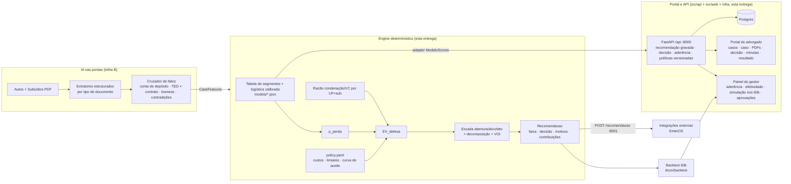

# Política de Acordos — Banco Unicamp · Grupo 3 (Hackathon Enter/Unicamp 2026)

> ~5 mil ações por mês alegam "não reconheço este empréstimo". Para cada uma, o advogado externo decide: **defender ou
> propor acordo?** Nossa resposta: uma política de acordos que é um **sistema de decisão econômico** — probabilidade
> calibrada de perder × custo total de litigar, comparada ao custo de acordar — com **IA nas pontas** (ler autos e
> subsídios, cruzar fatos, redigir) e **estatística determinística no centro** (decidir e precificar), fechada por um
> **monitoramento que aprende** (aderência com taxonomia de desvio, curva de aceite por experimento). Custo por caso:
> centavos. Decisão: < 1 ms. Tudo reproduzível na base de 60 mil sentenças.

Este README consolida **todas as decisões** do grupo e o que aprendemos com os dados e com as 10 submissões da edição
UFMG. Documentos de apoio: [`docs/politica.md`](docs/politica.md) (política em linguagem jurídica),
[`docs/premissas.md`](docs/premissas.md) (cada número: observado × premissa), [`docs/backtest/resumo.md`](docs/backtest/resumo.md)
(números gerados por script), [`SETUP.md`](SETUP.md) (como rodar).

---

## 1. A política em uma tela (para o jurídico)

| Faixa | Quando | Ação |
|---|---|---|
| 🟢 **Verde — defender** | Contrato **e** extrato presentes e consistentes (crédito na conta do autor). Perda < 15%. **57% dos casos, 20% do custo** | Contestação padrão; se a petição contradiz o extrato, alegar má-fé |
| 🟡 **Amarela — instruir antes de decidir** | Falta contrato **ou** extrato, mas recuperá-lo derruba o custo esperado em > 10% do valor da causa. **19% dos casos** | Solicitar o subsídio ao banco (5 dias). Veio → reavaliar. Não veio → acordar |
| 🔴 **Vermelha — acordar já** | Perda > 60% **ou** sinal grave (crédito em conta de terceiro, biometria ausente em canal digital, documento inconsistente). **24% dos casos, 59% do custo** | Propor na 1ª oportunidade: cancelamento + baixa do saldo + devolução das parcelas + indenização, seguindo a escada **abertura / alvo / teto** |

Regras de ouro: nunca acima do teto (90% do custo esperado de litigar); política não é divulgada (23% de extinções
sugerem litigância em massa); toda decisão é registrada contra a recomendação vista; documento que não prova o que
deveria não conta. Texto completo em [`docs/politica.md`](docs/politica.md).

**Potencial financeiro** (backtest com resultados reais dos 60 mil casos, `make backtest`):

| Cenário | Custo total | Economia vs. defender tudo |
|---|---|---|
| Defender tudo (o que acontece hoje): condenação R$ 193M + honorários + custas + correção + escritório | **R$ 342,9M** | — |
| Acordar tudo no alvo | R$ 246,6M | R$ 96M (28%) |
| **Política (acordo em 36% dos casos)** | **R$ 236,7M** | **R$ 106M (31%)** |
| Política com aceite fixo em 50% / 80% | R$ 283M / R$ 244M | R$ 60M (17%) / R$ 99M (29%) |

Ordem de grandeza: **R$ 5–9 milhões por mês** em 5 mil casos. Sensibilidade completa (aceite × valor da oferta × custos)
em `docs/backtest/`. Todos os custos além da condenação são premissas declaradas e ajustáveis em
[`policy.yaml`](src/enteros/policy/policy.yaml).

### Números completos do backtest

<!-- backtest:inicio -->
_Bloco gerado por `make backtest`; não edite à mão._

### Backtest da política `2026.09.12-v1` (modelo `logit-60000-20260912`)

Base: **60,000 processos** (base completa da Enter).
Custos reais de defender usam o resultado que de fato ocorreu (condenação, êxito, extinção); ver premissas em `docs/premissas.md`.

#### Modelo de probabilidade de perda (out-of-fold, 5 folds)
- AUC **0.923** · Brier 0.093 · acurácia@0,5 87.2% · ECE **0.003** · taxa de perda 30.4%

| p prevista | n | prevista média | observada |
|---|---|---|---|
| -0.0–0.1 | 29,363 | 0.042 | 0.041 |
| 0.1–0.2 | 7,541 | 0.142 | 0.145 |
| 0.2–0.3 | 2,552 | 0.246 | 0.254 |
| 0.3–0.4 | 849 | 0.351 | 0.326 |
| 0.4–0.5 | 2,628 | 0.455 | 0.456 |
| 0.5–0.6 | 2,662 | 0.548 | 0.558 |
| 0.6–0.7 | 1,637 | 0.649 | 0.631 |
| 0.7–0.8 | 3,242 | 0.753 | 0.748 |
| 0.8–0.9 | 3,028 | 0.847 | 0.847 |
| 0.9–1.0 | 6,498 | 0.973 | 0.974 |

#### Financeiro
- Condenações históricas: **R$ 193.0M** (R$ 3,216 por caso; ~R$ 16.1M/mês em 5 mil casos)
- Custo real de **defender tudo** (condenação + honorários + custas + tempo + escritório): **R$ 342.9M**
- Custo de **acordar tudo** no alvo (curva de aceite): R$ 246.6M
- Custo sob a **política** (curva de aceite): **R$ 236.7M** → economia **R$ 106.3M (31.0%)**, acordo em 36.2% dos casos

##### Sensibilidade (economia vs. defender tudo)
| taxa de aceite | oferta × | custo | economia | % |
|---|---|---|---|---|
| 0.5 | 0.8 | R$ 270.7M | R$ 72.3M | 21.1% |
| 0.5 | 1.0 | R$ 283.4M | R$ 59.6M | 17.4% |
| 0.5 | 1.2 | R$ 296.0M | R$ 46.9M | 13.7% |
| 0.6 | 0.8 | R$ 254.9M | R$ 88.0M | 25.7% |
| 0.6 | 1.0 | R$ 270.1M | R$ 72.8M | 21.2% |
| 0.6 | 1.2 | R$ 285.3M | R$ 57.6M | 16.8% |
| 0.7 | 0.8 | R$ 239.2M | R$ 103.8M | 30.3% |
| 0.7 | 1.0 | R$ 256.9M | R$ 86.0M | 25.1% |
| 0.7 | 1.2 | R$ 274.7M | R$ 68.3M | 19.9% |
| 0.8 | 0.8 | R$ 223.4M | R$ 119.5M | 34.9% |
| 0.8 | 1.0 | R$ 243.7M | R$ 99.2M | 28.9% |
| 0.8 | 1.2 | R$ 264.0M | R$ 79.0M | 23.0% |
| curva | 0.8 | R$ 216.1M | R$ 126.8M | 37.0% |
| curva | 1.0 | R$ 236.7M | R$ 106.3M | 31.0% |
| curva | 1.2 | R$ 257.2M | R$ 85.7M | 25.0% |

##### Faixas
| faixa | casos | % casos | p perda prevista | perda real | condenação real | custo real defesa |
|---|---|---|---|---|---|---|
| amarela | 11,289 | 18.8% | 35.7% | 35.7% | R$ 41.3M | R$ 71.6M |
| verde | 34,286 | 57.1% | 5.4% | 5.4% | R$ 19.1M | R$ 68.0M |
| vermelha | 14,425 | 24.0% | 85.9% | 85.8% | R$ 132.5M | R$ 203.3M |

#### Subsídios
| documento | perda quando presente | perda quando ausente | Δ p.p. |
|---|---|---|---|
| Contrato | 12.7% | 75.3% | +62.6 |
| Extrato | 18.8% | 81.7% | +62.9 |
| Comprovante de crédito (BACEN) | 19.9% | 46.7% | +26.8 |
| Dossiê | 30.5% | 30.4% | -0.0 |
| Demonstrativo de evolução da dívida | 27.8% | 39.4% | +11.7 |
| Laudo referenciado | 30.5% | 30.3% | -0.2 |

Valor da informação — custo esperado de litigar evitável se o subsídio ausente fosse recuperado:
| documento | casos sem | ganho total | por caso |
|---|---|---|---|
| Contrato | 17,017 | R$ 110.1M | R$ 6,469 |
| Extrato | 11,105 | R$ 62.0M | R$ 5,579 |
| Comprovante de crédito (BACEN) | 23,586 | R$ 46.7M | R$ 1,981 |
| Demonstrativo de evolução da dívida | 13,785 | R$ 10.4M | R$ 751 |

<!-- backtest:fim -->

---

## 2. O que os dados dizem (60.000 sentenças, 2 abas, join 1:1)

| Achado | Número | Consequência na política |
|---|---|---|
| **Contrato e extrato decidem** | perda 13% × 75% (contrato); 19% × 82% (extrato) | são os dois documentos "críticos"; a faixa verde exige ambos |
| Comprovante BACEN e demonstrativo ajudam menos | 20% × 47%; 28% × 39% | pesam no modelo, não definem faixa |
| **Dossiê e laudo não movem nada** | 30,5% × 30,4%; 30,5% × 30,3% | não entram na faixa; insight para o banco: perícia terceirizada não compra êxito |
| Nº de subsídios → êxito | 0→0% · 1→3% · 2→13% · 3→34% · 4→64% · 5→87% · 6→96% | monotônico; o engine garante que mais docs nunca aumenta o risco |
| Sub-assunto | Golpe perde 36%; Genérico 17% | feature |
| UF | AP/AM perdem ~48% e pagam 84% do pedido; MA perde 21% e paga 60% | feature + razão de condenação por UF |
| Valor da causa | **não** altera a probabilidade de perder (69–70% em todas as faixas) | condenação escala linearmente com o VC |
| Condenação dado perda | 70% do VC em média (p20 0,55 · p50 0,74 · p80 0,86) | quantis para a escada |
| Acordos históricos | 280, fechados a 20–40% do VC (mediana 29%), 74% sem contrato | âncora da curva de aceite |
| Extinção | 23% dos casos, independente de docs | mantida no backtest como defesa vencida com condenação zero; sinal de litigância predatória |
| Modelo logístico (docs + sub + UF) | **AUC 0,923 · Brier 0,093 · ECE 0,003** (out-of-fold, 5 folds) | calibração quase perfeita → o valor esperado é confiável |

### Os dois processos exemplo são extremos deliberados

| | Caso 01 — São Luís/MA | Caso 02 — Manaus/AM |
|---|---|---|
| Canal | correspondente por telefone, assinatura manuscrita | app mobile, biometria |
| Subsídios | 6/6; dossiê conforme (assinatura 91%, liveness 97%) | 3/6: sem contrato, sem extrato, sem dossiê |
| Prova de proveito | extrato: crédito R$ 5 mil + TED para conta própria + PIX + saque em São Luís | crédito em conta da **Caixa** que o autor diz não ter; laudo admite **liveness não localizado** |
| Autor | idosa, pede R$ 15 mil de dano moral, VC R$ 20 mil | idoso, BO + BACEN, pede R$ 18 mil, VC R$ 25 mil |
| Engine | **DEFESA** · perda 0,9% · a petição diz "jamais utilizou os valores" — o extrato prova o contrário | **ACORDO** · perda 97% · litigar custa ≈ R$ 30 mil · escada R$ 9,0 mil / **R$ 11,25 mil** / R$ 17,5 mil (devolução R$ 1.440 + baixa R$ 2.748 + indenização) |

---

## 3. O que os 10 grupos da UFMG fizeram — e onde ficaram os furos

Tabelas completas por grupo (stack, regra de decisão, fórmula de valor, UI, monitoramento, ideia única, furo) em [`docs/analise_ufmg_2026.md`](docs/analise_ufmg_2026.md).

**Vencedor (Exit.OS, G1)**: XGBoost com limiar fixo 0,60 → depois precifica com banda de quantis empíricos. Venceu pelos
**artefatos concretos por processo** (`Defesa.pdf` gerado por LLM com prompt bem guardado, `Contato.json` com o
advogado adverso extraído dos autos) e por UX memorável (cronômetro, chips de "recibo de leitura"). Sem número
financeiro, sem persistência, não reproduzível. **Pódio (G10)**: infra pesada (Postgres/pgvector/Docker), UX rica
(Central de Evidências, trechos citados, justificativa se delta > 15%), mas a **LLM fazia a conta do valor** e o deck
prometia RAG de 60k que não existia.

Ideias únicas dos demais: G8 apetite de risco como quantil dos 280 acordos + IFP; G2 formulação probabilística limpa
+ economia contrafactual; G3-UFMG matriz UF × nº docs com backtest real + LLM-as-judge; G7 único a modelar aceite do
autor (parâmetros chutados) e otimizar a oferta; G9 registro de premissas H1–H14 com "observado × assumido"; G4
política gerada/criticada/versionada por LLM + regras duras + checagem contrato × depósito; G6 KPIs fatiados por
"seguiu × não seguiu"; G5 score qualitativo da LLM move o limiar + saída "extinção".

**Table stakes** (todos fizeram; não diferencia): custo esperado como framing; 6 flags + UF + sub-assunto; upload →
extração → card com justificativa em linguagem natural; botão de confirmar; dashboard de aderência; dial de apetite.

**Furos que ninguém fechou** (e que atacamos): (1) valor esperado com custo **total** de litigar e limiar derivado da
economia; (2) número financeiro **tirado dos dados por script reproduzível**; (3) **calibração** de verdade; (4)
verificação de **conteúdo** dos documentos e contradições petição × subsídios; (5) dossiê/laudo inúteis + **valor de
recuperar** um subsídio ausente; (6) loop de efetividade com **experimento** para aprender a curva de aceite; (7)
aderência com **taxonomia de desvio**; (8) oferta **decomposta** + escada + mensagem ao adverso; (9) **evals** de LLM;
(10) rodar com um comando, com e sem chave.

---

## 4. Nossos diferenciais (por critério de avaliação)

| # | Diferencial | Critério |
|---|---|---|
| D1 | **Decisão por valor esperado**: `EV_defesa = escritório + p·[cond·(1+honorários)·tempo + custas]` vs `EV_acordo = a·alvo + (1−a)·EV_defesa + op`. O limiar cai da economia, não é 0,60 arbitrário | Leitura do problema · Execução |
| D2 | **Backtest reproduzível** com resultados reais, baselines "defender tudo" e "acordar tudo", sensibilidade e gráficos (`make backtest`) | Potencial financeiro · Execução |
| D3 | **Escada decomposta**: abertura / alvo / teto; alvo = argmin do custo esperado sob curva de aceite (premissa declarada); piso = devolução simples; oferta = cancelamento + baixa + devolução + indenização | Criatividade · Leitura |
| D4 | **Auditoria de conteúdo por IA** (trilha em andamento): titularidade da conta de depósito, TED × valor liberado, liveness, dossiê favorável, contradições da petição. Documento inconsistente é **rebaixado** a ausente pelo engine | Uso de IA · Execução |
| D5 | **Valor da informação**: faixa amarela "instruir antes de acordar"; para o banco, recuperar contratos ausentes evitaria **R$ 110M** de custo esperado; extratos, **R$ 62M**; dossiê/laudo: zero | Leitura do problema |
| D6 | **Monitoramento que aprende** (trilha em andamento): taxonomia de desvio, justificativa por código, scorecard com controle estatístico, funil de negociação, curva de aceite por **bandas de oferta randomizadas** (15% de exploração) → bandit ajusta o alvo | Execução · Uso de IA |
| D7 | **Onde o advogado trabalha**: API `POST /recomendacao` que o EnterOS chamaria + portal completo (`src/web` sobre `src/api`): lista de casos, caso com recomendação, PDFs, decisão com justificativa, minutas, resultado; link mágico para a banca | Usabilidade · Viabilidade |
| D8 | **Evals e guardrails**: LLM nunca decide dinheiro; saídas validadas por schema; golden set com os 2 casos + sintéticos (trilha em andamento) | Uso de IA |

---

## 5. Registro de decisões (ADR curto)

| # | Decisão | Por quê |
|---|---|---|
| 1 | **Valor esperado em vez de limiar de probabilidade** | 0,60 (usado por 3 grupos) não tem justificativa econômica; o EV torna o limiar função dos custos e explicável ao jurídico |
| 2 | **Regressão logística + tabela de segmentos, não XGBoost** | A base é quase linear em log-odds (AUC 0,923 vs ~0,92 dos XGBoost dos outros grupos); artefato é um JSON de 30 coeficientes, auditável e sem dependência; a tabela de segmentos (831 células com shrinkage) é a política em forma de planilha |
| 3 | **Média entre tabela e logística; intervalo = discordância** | Segmentos raros são suavizados; a discordância vira medida de incerteza mostrada ao advogado |
| 4 | **Dossiê e laudo ficam no modelo mas não definem faixa** | Efeito observado é zero; manter como feature evita "esconder" o dado; a faixa usa só o que o juiz olha |
| 5 | **LLM só nas pontas** (extrair, cruzar fatos, redigir); engine determinístico | Custo (centavos/caso), latência, consistência entre advogados e auditabilidade — G10 perdeu credibilidade deixando a LLM calcular valor |
| 6 | **Extinção mantida no backtest** como defesa vencida com condenação zero | Excluir 23% da base enviesaria o baseline (o vencedor anterior excluiu) |
| 7 | **Curva de aceite é premissa declarada + experimento** | Só há 280 acordos, todos aceitos (viés de seleção); a base não permite estimar a curva — por isso 15% de exploração em bandas para aprendê-la |
| 8 | **Custos de defesa como parâmetros com fonte** (`policy.yaml`, `docs/premissas.md`) | A base não tem honorários, custas nem datas; o jurídico ajusta e o backtest mostra a sensibilidade |
| 9 | **Sinais da IA entram por regra dura, não pelo modelo** | O histórico não tem esses rótulos; vender "conta de terceiro" como feature treinada seria desonesto (Súmula 479 STJ justifica a regra) |
| 10 | **Nenhum dado da Enter no repositório** | Regra da organização; versionamos só modelos em JSON, resumo do backtest e um CSV sintético gerado pelos modelos |
| 11 | **Engine roda sem banco (`make demo`)**; persistência, portal do advogado e painel do gestor vivem na API FastAPI + Postgres + React (`src/api`, `src/web`, `infra/`, um Caddy) | O engine continua reproduzível com um comando; o portal é onde advogado e gestor trabalham e onde a recomendação vista fica gravada |
| 12 | **React + Vite + Tailwind para a tela** (time tem frontend); Streamlit descartado | Foi o que 4 grupos usaram; usabilidade é critério |
| 13 | **Constantes centralizadas** (`config.py`, `policy.yaml`); nomes de domínio em português | Nada hardcoded; política versionada é requisito de aderência |
| 14 | **Limitações declaradas no deck** | G10 perdeu credibilidade prometendo o que não entregou |

---

## 6. Arquitetura

**Como as duas camadas se encaixam.** O engine é a política de referência e a fonte dos números deste README; o portal é a camada operacional: grava a recomendação exata que o advogado viu (aderência é medida contra ela), exige justificativa no desvio, manda acordos fora da banda para aprovação, registra o resultado da negociação e deixa o gestor simular parâmetros da política sobre os 60 mil casos em ~15 ms. A API do portal consome o modelo do engine (`models/*.json`) por um adapter (`MODEL_IMPL=app.modelo_enteros:ModeloEnteros`) e aplica a política operacional versionada no banco (`core/politica.py`); o mapa entre os parâmetros das duas políticas está em [`memory-bank/contratos.md`](memory-bank/contratos.md). Estado vivo do sistema, tabelas e fluxos: [`memory-bank/arquitetura.md`](memory-bank/arquitetura.md).

**Contratos** (`src/enteros/schemas.py`): `CaseFeatures` (UF, sub-assunto, valor da causa, status de cada subsídio
`presente|ausente|inconsistente`, e opcionais da IA: titularidade da conta, liveness, parcelas pagas, saldo, dano moral
pedido, contradições, red flags) → `Recomendacao` (decisão `defesa|acordo|instruir`, faixa, p_perda e intervalo,
condenação p20/p50/p80, EV de defesa e de acordo, escada, decomposição, VOI por documento, motivos, regras acionadas,
contribuições por feature, versões da política e do modelo).

**Custo e performance**: engine < 1 ms; API < 50 ms; IA documental estimada em 2–3 chamadas/caso com modelo barato e
cache por hash → **≈ R$ 0,05–0,15 por caso, < R$ 1 mil/mês** para 5 mil casos, contra R$ 5–9 milhões/mês de economia.

---

## 7. Divisão de trabalho e cronograma

| Trilha | Entrega | Pasta | Estado |
|---|---|---|---|
| A · Dados/Política | loader, modelos calibrados, engine EV, escada, VOI, `policy.yaml`, backtest, API, testes | `src/enteros/{data,policy,backtest,api}` | ✅ esta entrega |
| B · IA documental | extratores por documento, cruzador de fatos/contradições, contato do adverso, minutas, golden set + `make eval` | `src/enteros/ia/` | 🔧 |
| C · UX advogado | portal: login, casos, caso (recomendação, PDFs em nova aba com recibo de leitura, decisão com cronômetro, minutas copiáveis, resultado), link mágico `/api/demo` | `src/web/src/pages/advogado`, `src/api` | ✅ básico · 🔧 polimento |
| D · Banco/Monitor | decisões em Postgres, aderência (desvio de tipo/valor, justificativas, por escritório/advogado/semana), efetividade (aceite real × hipótese, economia realizada), simulação de parâmetros nos 60k, aprovações | `src/api/app/services/{metricas,backtest}.py`, `src/web/src/pages/gestor` | ✅ números · 🔧 gráficos e experimento |
| E · Entrega | deck 15 min, vídeo 2 min, README/SETUP finais | `docs/` | 🔧 |

Cronograma (12→13/09): H0–2 scaffold + dados + engine · H2–8 trilhas em paralelo · H8–11 integrar os 2 casos ponta a
ponta · H11–13 números do backtest no deck · H13–14 vídeo · H14–15 buffer · **submissão até 04:00** (prazo 04:30).

---

## 8. Status por requisito

| # | Requisito | Onde | Estado |
|---|---|---|---|
| 1 | Regra de decisão acordo × defesa | `policy/engine.py` (EV + faixas + regras duras), `policy.yaml` | ✅ |
| 2 | Sugestão de valor | `policy/negotiation.py` (escada abertura/alvo/teto, decomposição) | ✅ |
| 3 | Acesso à recomendação | `enteros/api/main.py` (`POST /recomendacao`); portal `src/web` (`/casos/:id`, resumo copiável, link mágico `/api/demo` para a banca) | ✅ |
| 4 | Monitoramento de aderência | portal: decisão gravada contra a recomendação vista, justificativa obrigatória no desvio, aprovação de acordos fora da banda, `GET /api/dashboard/aderencia` | ✅ |
| 5 | Monitoramento de efetividade | `backtest/` (economia vs. baselines, sensibilidade, calibração); portal: resultado da negociação, aceite real × hipótese, economia realizada, `GET /api/dashboard/efetividade` | ✅ · 🔧 experimento de bandas |

---

## 9. Limitações conhecidas
- Base sintética e uniforme por UF; sem datas → sem modelo de duração nem de custo de capital observado.
- Só 280 acordos, todos aceitos → curva de aceite é premissa (por isso o experimento de bandas).
- Custos de defesa (honorários, custas, escritório) são parâmetros a confirmar com o jurídico; o backtest mostra a sensibilidade.
- IA lê PDFs digitais; autos escaneados exigem OCR. Dois processos exemplo → golden set precisa de casos sintéticos.
- Sem dados do advogado da parte autora (OAB) → detecção de litigância predatória é próximo passo.

## 10. Próximos passos com +1 mês
Integração ao EnterOS (webhook de novo caso → parecer); OCR; ingestão do resultado real de negociação e recalibração
mensal; bandit de oferta em produção com alçadas; features de litigância predatória (OAB, comarca, boilerplate);
modelo de duração com datas reais; expansão a cartão e outras modalidades.

---

## Como rodar
Ver [`SETUP.md`](SETUP.md). Resumo: `make install && make demo` roda o engine (sobre `data/exemplos/sinteticos.csv` se a
planilha da Enter não estiver em `data/raw/`); `make engine-api` → `http://localhost:8001/docs`. Portal completo com
Postgres: `make up && make jobs-docker` → `http://localhost:8080` (usuários e senha em `SETUP.md`).

## Enunciado original do desafio
O texto do organizador (contexto, requisitos, critérios, prazos e instruções de submissão) está em
[`docs/desafio.md`](docs/desafio.md).
