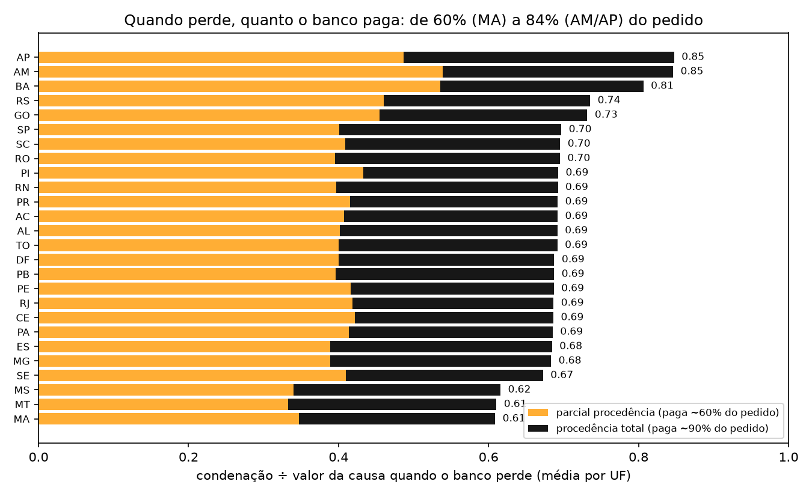
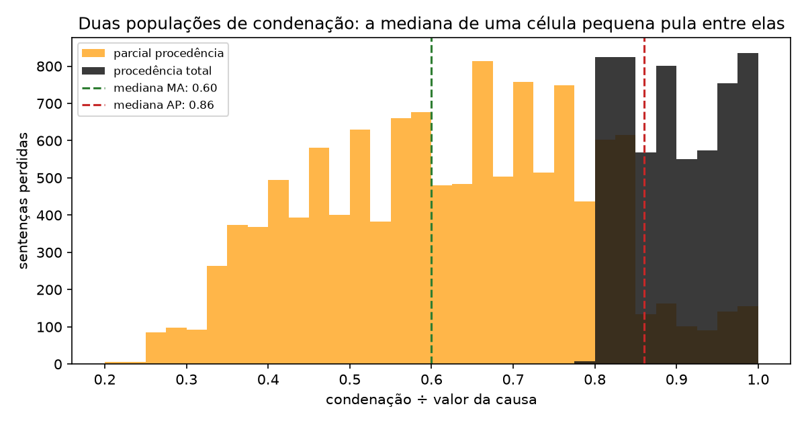
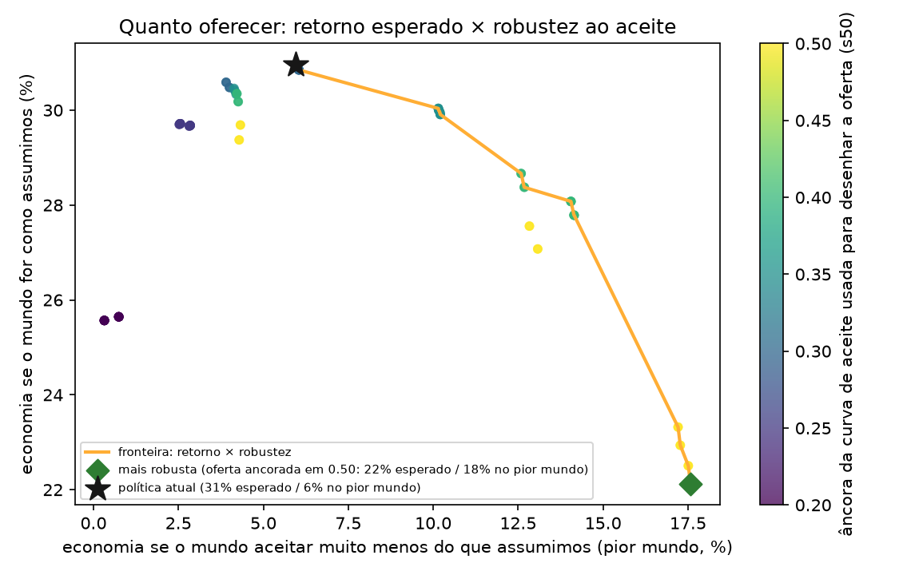
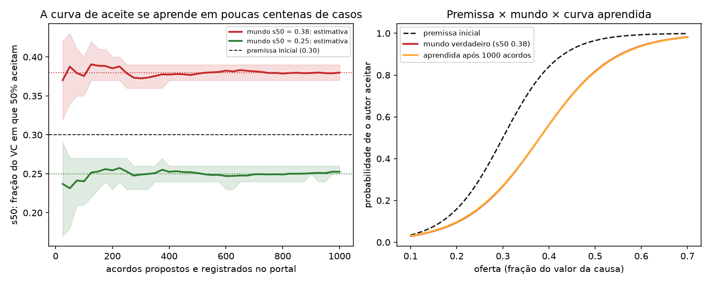

# Análises para a demo (`make analises`)

Só leitura dos modelos e da base; nada aqui altera o engine. Figuras em `docs/analises/*.png`.

## 1. Severidade: quanto o banco paga quando perde não é constante
- Amplitude entre UFs: **0.61 (MA) → 0.85 (AP)** do valor da causa; sd entre UFs 0.058.
- Procedência total paga em média 0.90 do pedido em **toda** UF (sd entre UFs 0.004); a parcial paga 0.61 em média e varia por UF (sd 0.081); 32% das perdas são procedência total.
- Da variação entre UFs, **94%** vem do nível da parcial e **1%** da fatia de procedência total.

| UF | perdas | condenação ÷ VC | % procedência total | média parcial | média procedência |
|---|---|---|---|---|---|
| MA | 470 | 0.61 | 29% | 0.49 | 0.90 |
| MT | 537 | 0.61 | 31% | 0.48 | 0.89 |
| MS | 570 | 0.62 | 31% | 0.49 | 0.89 |
| BA | 804 | 0.81 | 30% | 0.77 | 0.89 |
| AM | 1,090 | 0.85 | 34% | 0.82 | 0.90 |
| AP | 1,099 | 0.85 | 40% | 0.81 | 0.90 |

- Células UF × sub-assunto com menos de 100 perdas: 8; sd (bootstrap) do p50 empírico 0.032 × 0.023 com o encolhimento que o modelo usa — a mediana bruta de uma célula pequena pula entre as duas populações.

## 2. Fronteira de política: quanto oferecer, e quanto risco de aceite correr
- 96 configurações (âncora da curva de aceite usada no desenho × teto × margem × limiar verde), cada uma avaliada sob um mundo que aceita segundo s50 ∈ [0.25, 0.3, 0.35, 0.4, 0.5] (a política assume 0.3; 0,50 é estresse: a 30% do VC quase ninguém aceita).
- **Política atual**: acordo em 36.3% dos casos; economia 31.0% no mundo assumido, 19.5% se s50 = 0,40 e 5.9% no estresse.
- **Maior economia esperada**: oferta ancorada em s50 0.30, teto 50% do VC, margem 10% → 31.0% (estresse 5.9%).
- **Mais robusta**: oferta ancorada em s50 0.50, teto 70%, margem 10% → 22.1% esperado, 17.6% no estresse, 31% de acordos.
- **Melhor na média dos mundos**: s50 0.35, teto 60%, margem 30% → média 24.4%.

| knob | valor | % acordo | economia (mundo assumido) | economia (média dos mundos) | economia (estresse) |
|---|---|---|---|---|---|
| aceite_s50 | 0.20 | 42.5% | 25.6% | 16.9% | 0.3% |
| aceite_s50 | 0.25 | 40.1% | 29.7% | 20.7% | 2.6% |
| aceite_s50 | 0.30 ← atual | 36.3% | 31.0% | 23.3% | 5.9% |
| aceite_s50 | 0.35 | 35.1% | 30.0% | 24.4% | 10.2% |
| aceite_s50 | 0.40 | 33.5% | 27.8% | 24.1% | 14.1% |
| aceite_s50 | 0.50 | 31.3% | 22.1% | 21.0% | 17.6% |
| teto_pct_causa | 0.40 | 36.3% | 30.6% | 22.0% | 3.9% |
| teto_pct_causa | 0.50 | 36.3% | 31.0% | 23.3% | 5.9% |
| teto_pct_causa | 0.60 | 36.3% | 31.0% | 23.3% | 5.9% |
| teto_pct_causa | 0.70 ← atual | 36.3% | 31.0% | 23.3% | 5.9% |
| margem_teto | 0.10 ← atual | 36.3% | 31.0% | 23.3% | 5.9% |
| margem_teto | 0.30 | 36.3% | 31.0% | 23.3% | 5.9% |
| limiar_verde | 0.15 ← atual | 36.3% | 31.0% | 23.3% | 5.9% |
| limiar_verde | 0.30 | 34.2% | 30.8% | 23.2% | 6.0% |

Leitura: os limiares das faixas quase não movem nada — a regra de custo esperado já decide. O que troca retorno por robustez é o nível da oferta: ancorar a escada num aceite mais exigente (s50 maior) oferece mais, perde um pouco no mundo assumido e protege se o autor for mais duro do que a base sugere. É a decisão do gestor, e ela não precisa de otimização sofisticada: o backtest inteiro custa milissegundos.

## 3. Curva de aceite: premissa hoje, aprendida em produção
- Prior: s50 = 0.3 ± 0.1 (fraco), largura uniforme. Cada acordo registrado no portal informa um intervalo do limiar do autor (aceitou no degrau k ⇒ limiar entre o degrau k−1 e o k; recusou tudo ⇒ acima do teto); 15% dos casos recebem uma banda aleatória [0.25, 0.3, 0.35] para explorar.

| mundo verdadeiro (s50) | acordos registrados | s50 estimado | ± | IC90 | erro |
|---|---|---|---|---|---|
| 0.38 | 50 | 0.388 | 0.027 | 0.34–0.43 | +0.008 |
| 0.38 | 100 | 0.376 | 0.015 | 0.35–0.40 | -0.004 |
| 0.38 | 300 | 0.373 | 0.009 | 0.36–0.39 | -0.007 |
| 0.38 | 500 | 0.378 | 0.007 | 0.37–0.39 | -0.002 |
| 0.38 | 1,000 | 0.380 | 0.004 | 0.37–0.39 | -0.000 |
| 0.25 | 50 | 0.231 | 0.027 | 0.18–0.27 | -0.019 |
| 0.25 | 100 | 0.240 | 0.019 | 0.21–0.27 | -0.010 |
| 0.25 | 300 | 0.249 | 0.010 | 0.23–0.26 | -0.001 |
| 0.25 | 500 | 0.251 | 0.007 | 0.24–0.26 | +0.001 |
| 0.25 | 1,000 | 0.253 | 0.005 | 0.25–0.26 | +0.003 |

| mundo (s50, largura) | economia com a premissa | economia com a curva aprendida | % acordo (premissa → aprendida) | ganho de aprender |
|---|---|---|---|---|
| (0.38, 0.08) | 21.2% | 23.4% | 36% → 35% | R$ 7.7M |
| (0.25, 0.05) | 34.7% | 36.3% | 36% → 39% | R$ 5.4M |

Leitura: com ~300 acordos registrados a estimativa já fica a menos de 0,02 do valor verdadeiro; o gestor recalibra a escada mensalmente com o que o portal grava.

## 4. Figuras adicionais para a demo
- `mapa_uf.png` — economia e % de acordos por UF: onde o banco mais perde, mais acorda.
- `quem_acorda.png` — distribuição da probabilidade de perder com as três ações e o ponto de indiferença.
- `instruir.png` — quanto vale pedir contrato/extrato antes de acordar, sob três chances de localizar.
- `../backtest/baselines.png` — o que aconteceu × heurísticas × limiar fixo × política × teto teórico.
- `../backtest/subsidios.png` — o que cada documento muda no resultado e quanto vale recuperá-lo.
- `../backtest/faixas.png` — poucos casos concentram o custo.
