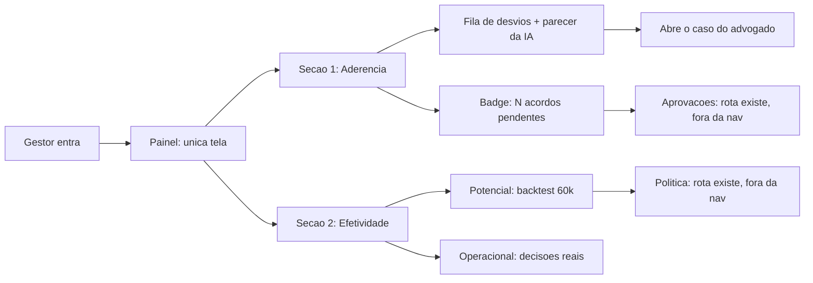

# Painel do gestor — monitoramento de aderência e efetividade

Especificação da segunda tela do produto. Fonte de verdade da **intenção**; o código é secundário.

## Objetivo

Uma tela responde às duas perguntas que o case exige do Banco Unicamp:

1. **Aderência** — os advogados estão seguindo a política de acordos?
2. **Efetividade** — a política está gerando o resultado esperado?

Tudo que não ajuda a responder uma das duas sai do primeiro olhar.

## Escopo

| Em escopo | Fora de escopo |
|---|---|
| Painel como única entrada de navegação do gestor | Redesenho das telas de Política e Aprovações |
| Agregados de aderência e efetividade | Alterar a regra de decisão ou os parâmetros da política |
| Parecer consultivo da IA sobre justificativas de desvio | IA decidindo se houve aderência |
| Gráficos de tendência, comparação e distribuição | Exportação, relatório agendado, e-mail |
| Distinção explícita entre potencial e operacional | Calibrar o backtest da API com o do engine |
| — | Tela do advogado |

Política e Aprovações **continuam existindo como rotas**, alcançáveis a partir do painel. Saem apenas da barra de navegação.

## Premissas

- Os agregados de aderência e efetividade já são servidos pela API; esta spec ajusta o recorte e acrescenta campos, não recria a camada.
- Os gráficos usam `@mantine/charts` sobre Recharts, herdando o tema já configurado (decisão 29).
- Sem decisões registradas, a seção operacional fica legitimamente vazia (decisão 28: não inventamos dados).
- O parecer da IA usa `OPENAI_MODEL` (padrão `gpt-4o-mini`) e a chave OpenAI do evento; sem chave válida, o painel funciona sem parecer.
- O backtest do engine é a fonte única dos números de potencial no painel e no deck.
- O baseline heurístico contrato + extrato fica fora do painel; pode ser explorado no deck.
- A identidade visual segue a decisão 29: acordo em laranja, defesa em tinta, animações curtas.

## Disambiguação

| Expressão | Leitura adotada |
|---|---|
| "Dashboard" | É o Painel. Mesma tela, nome em português na navegação. |
| "Economia" | Sempre qualificada: **potencial** (simulada no histórico) ou **estimada** (sobre acordos com resultado registrado). Nunca "realizada". |
| "Aderência" | Regra determinística: tipo decidido e valor proposto contra a recomendação gravada. A IA nunca altera esse número. |
| "Taxa de aceite" | Aceitos ÷ acordos **com desfecho registrado**. Acordos sem resultado ficam fora do denominador e aparecem como cobertura. |

## Componentes

Implementáveis nesta ordem; cada um é uma fatia testável.

### 1. Navegação do gestor

**Intenção.** O gestor entra e vê monitoramento, não um menu de ferramentas.

**Contrato.** A navegação do gestor apresenta apenas o Painel. Política, Aprovações e a lista de casos permanecem acessíveis por rota direta e por links contextuais dentro do Painel: o bloco de potencial leva à Política; o badge de pendências leva às Aprovações; cada desvio leva ao caso.

**Done when.** No lado do gestor a navegação tem uma única entrada; as rotas antigas continuam abrindo quando acessadas diretamente; nenhum link fica órfão.

### 2. Seção de aderência

**Intenção.** Mostrar se a política está sendo seguida e por quem não está.

**Entradas.** Agregados de decisões comparadas à recomendação gravada, agrupados por escritório, advogado e semana, mais a lista dos desvios recentes com justificativa.

**Contrato.** Três níveis de leitura, nesta hierarquia visual:

| Nível | Conteúdo | Forma |
|---|---|---|
| Resposta | Percentual de aderência e volume de decisões | Número grande com estado por cor; verde a partir de 80% |
| Leitura | Aderência por escritório (ordenada, pior primeiro) e evolução semanal | Barra horizontal e linha |
| Ação | Fila de desvios: quando, processo, advogado, recomendado, decidido, justificativa, situação | Tabela com linha clicável |

Desvio de tipo e desvio de valor são apresentados como **decomposição** do total não aderente, não como métricas independentes. Tempo médio de análise, percentual que decidiu sem ver a recomendação e a quebra por advogado vão para um bloco recolhível.

**Done when.** Com decisões na base, o gestor identifica o escritório de pior aderência sem rolar a página e abre um caso divergente em um clique. Sem decisões, a seção mostra estado vazio explicando o que a preencherá.

### 3. Seção de efetividade

**Intenção.** Separar o que a política **vale** do que ela **já rendeu**, sem que um número seja confundido com o outro.

**Contrato.** Dois blocos rotulados, nunca somados:

| Bloco | O que mostra | Base |
|---|---|---|
| Potencial | Custo de defender tudo, de acordar tudo e sob a política; economia e percentual de casos em acordo | 60 mil sentenças históricas, com resultado judicial real para a defesa e curva de aceite estimada para os acordos |
| Operacional | Taxa de aceite real contra a hipótese da política, desfechos das negociações, cobertura de resultados e economia estimada nos acordos concluídos | Apenas decisões e resultados registrados por advogados no portal |

O bloco de potencial declara, no próprio card, que é simulação sobre histórico com premissas de custo. O bloco operacional exibe a **cobertura**: proporção de acordos ainda sem desfecho registrado. Quando a cobertura é baixa, a taxa de aceite é apresentada como preliminar.

Os três totais do potencial vêm do backtest versionado do engine e o painel cita a versão da política e do modelo.

**Done when.** Um leitor que não conhece o projeto distingue, sem perguntar, qual número é simulação e qual é resultado medido; a taxa de aceite nunca aparece sem sua cobertura.

### 4. Parecer da IA sobre justificativas

**Intenção.** Ajudar o gestor a triar desvios: distinguir uma justificativa jurídica fundamentada de uma genérica. É **consultivo**.

**Entradas.** Texto da justificativa, recomendação que o advogado viu, decisão tomada, valor proposto, e os fatos determinísticos do caso: UF, sub-assunto, valor da causa, subsídios presentes e ausentes, probabilidade de êxito e faixa de condenação estimada.

**Contrato.** Geração **sob demanda**: o gestor solicita o parecer de um desvio e o resultado é persistido, de modo que a mesma justificativa não é reavaliada nem cobrada duas vezes. A chamada usa o provedor real e `OPENAI_MODEL`; a persistência limita naturalmente o consumo a um parecer por decisão. A avaliação **não** altera o cálculo de aderência, nunca aprova nem rejeita um acordo, e é sempre rotulada como análise assistida por IA. Falha na chamada, chave ausente ou tempo esgotado degradam a funcionalidade sem quebrar o painel: a linha do desvio continua visível, sem parecer.

**Saída — contrato de dados.**

| Campo | Tipo | Obrigatório | Notas |
|---|---|---|---|
| `decisao_id` | inteiro | sim | Desvio avaliado |
| `classificacao` | enumeração | sim | `fundamentada`, `generica`, `contradiz_evidencias` |
| `resumo` | texto | sim | Uma ou duas frases em português, para leitura em tabela |
| `pontos` | lista de texto | não | Elementos concretos citados ou ausentes na justificativa |
| `confianca` | decimal 0–1 | sim | Confiança declarada pelo modelo |
| `modelo` | texto | sim | Identificação do modelo usado |
| `gerado_em` | data-hora | sim | Momento da geração |

**Done when.** O gestor gera um parecer, recarrega a página e o parecer persiste; com a integração desligada o painel se comporta normalmente; nenhuma métrica de aderência muda por causa do parecer.

### 5. Gráficos e identidade visual

**Intenção.** O painel comunica em segundos, com a cara da Enter.

**Contrato.** Quatro representações, cada uma com um propósito distinto: barra horizontal ordenada para comparar escritórios; linha para tendência semanal de aderência e aceite; barras comparativas para os três cenários de custo; distribuição para os desfechos das negociações. As cores seguem os tokens existentes, sem paleta nova. Animações respeitam a preferência de movimento reduzido. Todo gráfico tem estado vazio textual quando não há dados, e rótulo de eixo ou legenda que dispense explicação verbal.

**Done when.** A tela é legível em desktop e em celular; nenhum gráfico aparece como área em branco quando a base está vazia; a verificação de tipos e o build do front passam.

## Verificação

| Componente | Unitário | Integração | E2E / Funcional |
|---|---|---|---|
| 1. Navegação | Itens de navegação por papel | — | Gestor vê só o Painel; rotas diretas continuam abrindo |
| 2. Aderência | Agregações por escritório, advogado e semana; decomposição dos desvios | Endpoint sobre base com decisões e com base vazia | Desvio abre o caso correspondente |
| 3. Efetividade | Taxa de aceite, cobertura e economia estimada, incluindo denominador zero | Endpoint com e sem histórico carregado | Potencial e operacional visualmente distintos |
| 4. Parecer da IA | Interpretação da resposta do modelo e validação do contrato de saída | Cache: segunda solicitação não chama o provedor; falha do provedor não derruba o endpoint | Gerar parecer, recarregar, parecer persiste |
| 5. Gráficos | Formatação de valores e percentuais | — | Build e verificação de tipos; estados vazios renderizam |

Testes de API rodam contra Postgres, como os existentes. O provedor de LLM é simulado em todos os níveis exceto numa verificação manual antes da demo.

## Alertas e operação

| Preocupação | Sintoma | Sinal candidato | Severidade | Notas |
|---|---|---|---|---|
| Painel sem dados | Seções vazias durante a demonstração | Contagem de decisões e de processos carregados na inicialização | Alta | Verificar antes da apresentação |
| Histórico ausente | Bloco de potencial sem números | Estado do histórico carregado em memória | Alta | O painel deve explicar a causa, não apenas omitir |
| LLM indisponível | Parecer nunca aparece | Falhas e tempo de resposta da chamada ao provedor | Média | Degradação silenciosa é aceitável; o painel não pode quebrar |
| Consumo de crédito | Gasto acima do previsto | Contagem de pareceres persistidos | Média | Um parecer por decisão divergente |
| Cobertura baixa | Taxa de aceite calculada sobre poucos desfechos | Proporção de acordos sem resultado registrado | Baixa | Já exposto no painel como cobertura |

## Referências

- Contexto, requisitos e donos: `memory-bank/contexto.md`
- Decisões 18, 25, 27, 28 e 29: `memory-bank/decisoes.md`
- Premissas de custo e limitações do backtest: `docs/premissas.md`
- Resultados do backtest do engine: `docs/backtest/`
