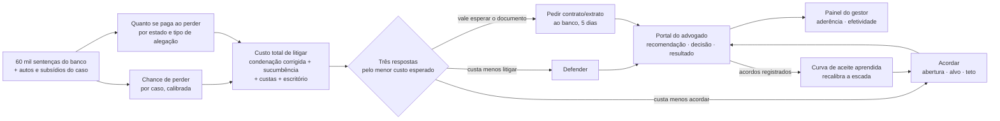
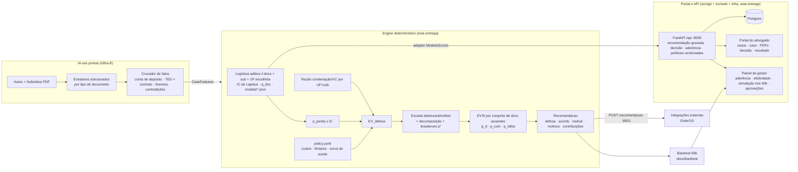

# Política de Acordos — Banco Unicamp · Grupo 3 (Hackathon Enter/Unicamp 2026)

> ~5 mil ações por mês alegam "não reconheço este empréstimo". Para cada uma, o advogado externo decide: **defender ou
> propor acordo?** Nossa resposta: uma política de acordos que é um **sistema de decisão econômico** — probabilidade
> calibrada de perder × custo total de litigar, comparada ao custo de acordar — com **IA nas pontas** (ler autos e
> subsídios, cruzar fatos, redigir) e **estatística determinística no centro** (decidir e precificar), fechada por um
> **monitoramento que aprende** (aderência com taxonomia de desvio, curva de aceite por experimento). Custo por caso:
> centavos. Decisão: < 1 ms. Tudo reproduzível na base de 60 mil sentenças.

Este relatório consolida **todas as decisões** do grupo e o que aprendemos com os dados. Documentos de apoio: [`docs/politica.md`](politica.md) (política em linguagem jurídica),
[`docs/premissas.md`](premissas.md) (cada número: observado × premissa), [`docs/backtest/resumo.md`](backtest/resumo.md)
(números gerados por script), [`docs/modelo/comparacao.md`](modelo/comparacao.md) (comparação de modelos pelo
custo de decisão), [`docs/analises/resumo.md`](analises/resumo.md) (análises e figuras para a demo),
[`SETUP.md`](../SETUP.md) (como rodar).

---

## TL;DR — modelo de decisão v2 (o que mudou e os números para o slide)

- **Inputs que valem**: contrato, extrato, comprovante de crédito, demonstrativo, sub-assunto e UF. **Dossiê e laudo têm
  efeito zero** (teste LR p = 0,26) e o **valor da causa não move a probabilidade** de perder (correlação 0,0006): ele só
  multiplica a perda. Assunto é constante.
- **Modelo**: uma regressão logística aditiva; UF com encolhimento bayesiano para a média; intervalo de credibilidade
  (Laplace) por caso. **Todas as alternativas empatam** — interações, saturação, gradient boosting, tabelas de células:
  AUC 0,9226 e **menos de R$ 1M de diferença no custo de decisão** out-of-fold (`make compare-models`).
- **Onde está o dinheiro**: na estrutura de custos e no valor da informação, não no modelo. Com o **custo total de litigar**
  (escritório R$ 1.200, sucumbência 15%, custas 2%, correção 1,196), acordar vale a pena a partir de p_perda ≈ **0,26**
  com oferta fixa de 30% do VC (≈ 0,47 no alvo da escada) — contra **0,58** numa conta sem custos e com aceite 100%.
  Isso leva a fatia de acordos de ~10% para **36%** dos casos.
- **Severidade não é constante**: condenação ÷ VC dado perda vai de **0,60 (MA) a 0,84 (AM/AP)**; Genérico 0,65 ×
  Golpe 0,72. Fica por UF × sub-assunto, com a razão de procedência total (28% → 45% das perdas).
- **Três ações**: defesa, acordo e **instruir** — pedir contrato/extrato ao banco antes de propor acordo. "Info" nasce do
  **valor esperado da informação** (com probabilidade total: buscar e não achar é notícia ruim), não de uma classe do
  classificador. Vale em **34% dos casos (93% dos acordos)** se a chance de localizar for a observada na base; 24% com metade.
- **Baselines nos 60 mil casos, mesmos custos** (`make backtest`): defender tudo **R$ 342,9M** · limiar fixo 0,60 (3 grupos
  da UFMG) R$ 257,9M (−24,8%) · **política R$ 236,8M (−31,0%)** · oráculo R$ 191,1M (−44,3%). A política captura **70% do
  ganho máximo possível** (o limiar, 56%). Banda: 31,1% ± 0,4 p.p. entre folds; bootstrap 30,6–31,4%.
- **Sensibilidade honesta**: aceite 50% → 17% · 65% → 23% · 80% → 29% · curva → 31%; âncora da curva s50 0,25 → 35% e
  0,50 → 18%; cenário JEC (sem custas nem sucumbência) → 23%. **O lado acordo é hipótese**; o lado defesa é fato.
- **Validação**: 5-fold out-of-fold para o modelo (holdout separado seria pior: sem datas não há corte temporal e 30
  parâmetros em 60 mil linhas não sobreajustam). **Nenhum corte valida a decisão de acordar** — todos os casos foram até a
  sentença — por isso o experimento de bandas de oferta em produção.
- **Bayesian Optimization**: não — nem para prever (60 mil rótulos e verossimilhança fechada) nem para os knobs (o
  backtest custa milissegundos; grid basta).

---

## Para os slides — parte do modelo (5 minutos, 6 slides)

Público: advogados e gestores do banco. Cada slide tem **um número, uma figura ou tabela e uma frase** que o jurado
repete depois. Vocabulário: "chance de perder", "custo total de litigar", "ponto de indiferença", "vale esperar o
documento". Sem AUC, Laplace, EVSI ou nome de algoritmo no slide — isso fica para as perguntas (seção 2b). As tabelas e o
diagrama prontos para copiar estão logo abaixo do roteiro.

| # | Slide | A frase | Material | O que falar (≈ 45 s) |
|---|---|---|---|---|
| 1 | **O problema em dinheiro** | "Defender tudo custa R$ 5,7 mil por processo — R$ 28 milhões por mês. 24% dos casos concentram 59% do custo." | [`docs/backtest/faixas.png`](backtest/faixas.png) | Hoje o advogado decide caso a caso sem ver o custo total. Poucos casos concentram o dinheiro; a política existe para achar esses casos antes da contestação. Contrato e extrato decidem (perda de 13% com contrato, 75% sem); dossiê e laudo não mudam nada. |
| 2 | **O custo total de litigar: a nossa conta × a conta padrão** | "Contar o custo todo muda a resposta: o ponto de indiferença cai de 58% para 26% de chance de perder — a diferença entre acordar 10% e 36% dos casos." | tabela **A** abaixo | A conta padrão compara a condenação com a oferta e corta num limiar redondo. A nossa soma o que o banco paga de fato ao perder: condenação corrigida pelo tempo, honorários de sucumbência, custas, o escritório que defende, e quanto se paga varia por estado (60% a 84% do pedido). O custo de acordar inclui a chance de o autor recusar. Por isso o ponto de indiferença sai da conta, caso a caso, e não é um número redondo. |
| 3 | **Três respostas, não duas** | "Além de defender ou acordar, há uma terceira resposta: pedir o contrato e o extrato ao banco e decidir em 5 dias — vale em 34% dos casos." | tabela **B** abaixo + [`docs/analises/quem_acorda.png`](analises/quem_acorda.png) | Verde: defender (57% dos casos). Vermelha: acordar já, na primeira oportunidade, com abertura, alvo e teto. Amarela: o caso pede acordo mas falta contrato e/ou extrato — e o par de documentos, se o banco localizar, vira o caso. Só esperamos quando o valor de esperar supera o custo dos 5 dias; sinal grave (crédito em conta de terceiro) não espera. Caso 02: só com as flags, pedir os documentos; com o crédito na conta de terceiro, acordar já. Para o gestor: o back-office que localiza documentos é a alavanca, não o laudo. |
| 4 | **Quanto vale, com a mesma régua para todo mundo** | "R$ 106 milhões a menos nos 60 mil casos (−31%). A regra de limiar fixo que outros grupos usaram economiza 25%; nós capturamos 70% do que um oráculo capturaria." | tabela **C** abaixo + [`docs/backtest/baselines.png`](backtest/baselines.png) | Mesmos custos para todas as linhas; só a regra de decisão muda. Acordar tudo é ruim (9%), as heurísticas de documento e o limiar fixo chegam a 24–25%, a política a 31%, e o teto teórico é 44%. Uma frase de honestidade: o lado defesa é fato, o lado acordo é hipótese de aceite — a economia vai de 17% a 31% conforme quanto os autores aceitam; a variação estatística é ±0,4 p.p. |
| 5 | **Como funciona, em um diagrama** | "Sessenta mil sentenças ensinam a chance de perder e quanto se paga; o custo total decide entre três respostas; o portal grava o que o advogado fez e o que o autor aceitou — e isso realimenta a oferta." | diagrama **D** abaixo | Ler o diagrama da esquerda para a direita em 30 segundos: dados → chance de perder e severidade por estado → custo total → três respostas com a escada de oferta → portal do advogado e painel do gestor → acordos registrados ensinam a curva de aceite e recalibram a escada. É a ponte para a parte de aderência e efetividade. |
| 6 | **Onde age, quanto oferecer e como aprende** | "Em AP e AM, 60% dos casos vão a acordo e o custo cai 43%; no MA, 26% e 22%. Em ~300 acordos registrados a curva de aceite já está aprendida." | [`docs/analises/mapa_uf.png`](analises/mapa_uf.png) + escada do Caso 02; apoio: [`aprendizado_aceite.png`](analises/aprendizado_aceite.png) | A oferta não é um número solto: cancelamento + baixa do saldo + devolução das parcelas + indenização, com abertura, alvo e teto (Caso 02: R$ 9 mil · R$ 11.250 · R$ 17,5 mil); o teto nunca passa de 90% do custo de litigar. A única coisa que a base não diz é quanto o autor aceita: cada acordo registrado no portal ensina isso, 15% dos casos testam bandas de oferta, e se o autor aceitar menos do que assumimos a política ainda economiza (o gestor escolhe uma oferta mais robusta na fronteira). |

O que mais pesa para essa banca: (1) a régua única de custos com o número de dinheiro e o teto teórico ao lado;
(2) a terceira resposta "pedir o documento" e o fato de que dossiê e laudo não movem nada — isso muda a operação do
banco, não só a do advogado; (3) a honestidade sobre o que é fato e o que é hipótese. Para perguntas: por que uma
regressão simples (todas as alternativas empatam), como validamos (out-of-fold; a decisão de acordar não é validável
por dado histórico) e a conta do ponto de indiferença — tudo na seção 2b.

### Material pronto para os slides

**A. Slide 2 — a nossa conta × a conta padrão**

| | Conta padrão (limiar fixo, usada por 3 grupos da edição UFMG) | A nossa conta |
|---|---|---|
| Chance de perder | modelo → corte num número redondo (0,60) | modelo calibrado nas 60 mil sentenças; chance por caso com intervalo |
| O que se perde ao perder | condenação | condenação **corrigida pelo tempo até pagar** (1% a.m. × 18 meses = 1,196) + **honorários de sucumbência** (15%, CPC art. 85) + **custas** (2% do valor da causa) + **escritório que defende** (R$ 1.200) + saldo devedor que se anula |
| Quanto se paga ao perder | um percentual fixo do valor da causa (~70%) | por estado e tipo de alegação: **60% (MA) a 84% (AM/AP)** do pedido |
| Custo de acordar | a oferta | oferta × chance de aceite + custo de litigar se o autor recusar + R$ 300 de negociação |
| Regra | acordo se a chance de perder passa de 60% | acordo se **custar menos**; o **ponto de indiferença** sai por caso (≈ 26% de chance de perder com oferta de 30% do valor da causa; 47% no alvo da escada) |
| Respostas possíveis | defender · acordar | defender · acordar · **pedir o documento antes** |
| Resultado nos 60 mil casos | 24% em acordo, **−24,8%** | 36% em acordo, **−31,0%** |

**B. Slide 3 — as três respostas** (a tabela da seção 1, encurtada)

| Resposta | Quando | O que o advogado faz | Casos |
|---|---|---|---|
| 🟢 **Defender** | contrato **e** extrato consistentes; chance de perder < 15% | contestação; se a petição contradiz o extrato, alegar má-fé | 57% |
| 🟡 **Pedir o documento antes** | o caso pede acordo, falta contrato e/ou extrato, e vale mais esperar 5 dias do que acordar já | solicitar ao banco; veio → reavaliar (normalmente vira defesa); não veio → acordar | vale em 34% dos casos (93% dos que iriam a acordo) |
| 🔴 **Acordar já** | chance de perder > 60% **ou** sinal grave (crédito em conta de terceiro, biometria ausente) | propor na primeira oportunidade: cancelamento + baixa do saldo + devolução + indenização, com abertura · alvo · teto | 24% (59% do custo) |

**C. Slide 4 — quanto vale, com a mesma régua** (60 mil casos, probabilidade fora da amostra, mesmos custos)

| Regra de decisão | Custo total | Economia | % acordo | Captura do máximo |
|---|---|---|---|---|
| Defender tudo (o que aconteceu) | R$ 342,9M | — | 0% | 0% |
| Acordar tudo a 30% do valor da causa | R$ 313,3M | 8,6% | 100% | 20% |
| Heurística "sem contrato → acordo" | R$ 260,7M | 24,0% | 28% | 54% |
| Limiar fixo p > 0,60 (grupos da UFMG) | R$ 257,9M | 24,8% | 24% | 56% |
| **Política (custo total + três respostas + escada)** | **R$ 236,8M** | **31,0% · R$ 106M** | 36% | **70%** |
| Oráculo: resultado conhecido (teto teórico) | R$ 191,1M | 44,3% | 30% | 100% |

Banda: 31,1% ± 0,4 p.p.; se os autores aceitarem 50% / 65% / 80% das ofertas: 17% / 23% / 29%.

**D. Slide 5 — como funciona, em um diagrama**



---

## 1. A política em uma tela (para o jurídico)

| Faixa | Quando | Ação |
|---|---|---|
| 🟢 **Verde — defender** | Contrato **e** extrato presentes e consistentes (crédito na conta do autor). Perda < 15%. **57% dos casos, 20% do custo** | Contestação padrão; se a petição contradiz o extrato, alegar má-fé |
| 🟡 **Amarela — instruir antes de acordar** | O caso pede acordo, falta contrato **e/ou** extrato, e o **valor esperado da informação** de pedi-los ao banco supera o custo da busca e dos 5 dias de espera (≥ 2% do VC). **19% dos casos na zona intermediária; instruir vale em 34% de todos os casos** | Solicitar os subsídios ao banco (prazo 5 dias). Vieram → reavaliar (normalmente vira defesa). Não vieram → acordar, com p ajustado para pior |
| 🔴 **Vermelha — acordar já** | Perda > 60% **ou** sinal grave (crédito em conta de terceiro, biometria ausente em canal digital, documento inconsistente). **24% dos casos, 59% do custo** | Propor na 1ª oportunidade: cancelamento + baixa do saldo + devolução das parcelas + indenização, seguindo a escada **abertura / alvo / teto** |

Regras de ouro: nunca acima do teto (90% do custo esperado de litigar, descontado o saldo baixado); política não é
divulgada (evita que a parte autora precifique a oferta); toda decisão é registrada contra a recomendação vista;
documento que não prova o que deveria não conta; decisão cujo intervalo de p cruza o ponto de indiferença (2% dos casos)
vai para revisão. Texto completo em [`docs/politica.md`](politica.md).

**Potencial financeiro** (backtest com resultados reais dos 60 mil casos e probabilidade out-of-fold, `make backtest`;
mesmos custos em todas as linhas — só a regra de decisão muda):

| Regra de decisão | Custo total | Economia vs. defender tudo | % acordo | Captura do ganho máximo |
|---|---|---|---|---|
| Defender tudo (o que aconteceu): condenação R$ 193M + honorários + custas + correção + escritório | **R$ 342,9M** | — | 0% | 0% |
| Acordar tudo a 30% do VC (aceite 65%) | R$ 313,3M | R$ 30M (8,6%) | 100% | 20% |
| Heurística "sem contrato → acordo" | R$ 260,7M | R$ 82M (24,0%) | 28% | 54% |
| Limiar fixo p_perda > 0,60 (3 grupos da UFMG) | R$ 257,9M | R$ 85M (24,8%) | 24% | 56% |
| **Política EV (escada + curva de aceite)** | **R$ 236,8M** | **R$ 106M (31,0%)** | 36% | **70%** |
| Oráculo: resultado conhecido, mesma escada (teto teórico) | R$ 191,1M | R$ 152M (44,3%) | 30% | 100% |

Banda do headline: **31,1% ± 0,4 p.p.** entre os 5 folds; bootstrap por caso IC95 30,6–31,4%. Sensibilidade ao aceite
(hipótese): 50% → 17% · 65% → 23% · 80% → 29%. Ordem de grandeza: **R$ 5–9 milhões por mês** em 5 mil casos. Todos os
custos além da condenação são premissas declaradas e ajustáveis em [`policy.yaml`](../src/enteros/policy/policy.yaml);
a sensibilidade a cada um (inclusive o cenário JEC) está no bloco abaixo.

### Números completos do backtest

<!-- backtest:inicio -->
_Bloco gerado por `make backtest`; não edite à mão._

### Backtest da política `2026.09.12-v2` (modelo `logit-60000-20260912`)

Base: **60,000 processos** (base completa da Enter).
Custos reais de defender usam o resultado que de fato ocorreu (condenação, êxito, extinção); ver premissas em `docs/premissas.md`.

#### Modelo de probabilidade de perda (out-of-fold, 5 folds)
- AUC **0.923** · Brier 0.093 · acurácia@0,5 87.3% · ECE **0.003** · taxa de perda 30.1%

| p prevista | n | prevista média | observada |
|---|---|---|---|
| -0.0–0.1 | 29,745 | 0.042 | 0.041 |
| 0.1–0.2 | 7,102 | 0.142 | 0.146 |
| 0.2–0.3 | 2,608 | 0.244 | 0.249 |
| 0.3–0.4 | 878 | 0.354 | 0.322 |
| 0.4–0.5 | 2,653 | 0.455 | 0.460 |
| 0.5–0.6 | 2,606 | 0.548 | 0.559 |
| 0.6–0.7 | 1,646 | 0.651 | 0.628 |
| 0.7–0.8 | 3,134 | 0.752 | 0.749 |
| 0.8–0.9 | 3,009 | 0.846 | 0.846 |
| 0.9–1.0 | 6,339 | 0.973 | 0.975 |


#### Financeiro
- Condenações históricas: **R$ 193.0M** (R$ 3,216 por caso; ~R$ 16.1M/mês em 5 mil casos)
- Custo real de **defender tudo** (condenação + honorários + custas + tempo + escritório): **R$ 342.9M**
- Custo de **acordar tudo** no alvo (curva de aceite): R$ 246.7M
- Custo sob a **política** (curva de aceite): **R$ 236.8M** → economia **R$ 106.2M (31.0%)**, acordo em 36.3% dos casos
- Probabilidade usada no replay: **out-of-fold** (5 folds; cada caso pontuado por um modelo que não o viu); acordos históricos (280) entram com o valor que de fato pagaram.

##### Baselines (mesmos custos; só a regra de decisão muda)
| regra | custo | economia | % | % acordo | captura do ganho máximo |
|---|---|---|---|---|---|
| Defender tudo (o que aconteceu) | R$ 342.9M | R$ 0 | 0.0% | 0.0% | 0% |
| Acordar tudo a 30% do VC (aceite 65%) | R$ 313.3M | R$ 29.6M | 8.6% | 100.0% | 20% |
| Heurística: sem contrato → acordo | R$ 260.7M | R$ 82.2M | 24.0% | 28.4% | 54% |
| Heurística: sem contrato e sem extrato → acordo | R$ 297.6M | R$ 45.3M | 13.2% | 10.8% | 30% |
| Limiar fixo p_perda > 0.60 (3 grupos da UFMG), oferta 30% | R$ 257.9M | R$ 85.1M | 24.8% | 23.8% | 56% |
| Política EV (p OOF, escada, aceite fixo 65%) | R$ 263.6M | R$ 79.3M | 23.1% | 36.3% | 52% |
| Política EV (p OOF, escada + curva de aceite) | R$ 236.8M | R$ 106.2M | 31.0% | 36.3% | 70% |
| Oráculo: resultado conhecido, mesma escada (teto teórico) | R$ 191.1M | R$ 151.9M | 44.3% | 30.4% | 100% |

Leitura: o ganho vem de decidir pelo custo total de litigar, não de prever melhor a sentença; a política captura a maior parte do que um oráculo capturaria.


##### Banda do número (variação amostral)
- Economia por fold: 30.7% · 30.9% · 31.7% · 30.9% · 31.2% → média **31.1% ± 0.4 p.p.**
- Bootstrap por caso (200×): IC95 **30.6% – 31.4%**
- O lado *acordo* é hipótese (curva de aceite): a banda mede só a variação amostral do modelo, não a incerteza sobre o aceite — ver sensibilidade.

##### Ponto de indiferença (breakeven) e decisões sensíveis
- p\* médio (p_perda em que acordar no alvo da escada custa o mesmo que defender): **0.47** (p5 0.24 · p95 0.84); casos cujo IC95 de p cruza p\*: **2.2%** (vão para revisão)

##### Sensibilidade ao aceite e ao valor da oferta (economia vs. defender tudo)
| taxa de aceite | oferta × | custo | economia | % |
|---|---|---|---|---|
| 0.5 | 0.8 | R$ 270.7M | R$ 72.2M | 21.1% |
| 0.5 | 1.0 | R$ 283.4M | R$ 59.5M | 17.4% |
| 0.5 | 1.2 | R$ 296.1M | R$ 46.8M | 13.6% |
| 0.6 | 0.8 | R$ 255.0M | R$ 88.0M | 25.7% |
| 0.6 | 1.0 | R$ 270.2M | R$ 72.7M | 21.2% |
| 0.6 | 1.2 | R$ 285.5M | R$ 57.5M | 16.8% |
| 0.7 | 0.8 | R$ 239.2M | R$ 103.7M | 30.2% |
| 0.7 | 1.0 | R$ 257.0M | R$ 85.9M | 25.1% |
| 0.7 | 1.2 | R$ 274.8M | R$ 68.1M | 19.9% |
| 0.8 | 0.8 | R$ 223.5M | R$ 119.5M | 34.8% |
| 0.8 | 1.0 | R$ 243.8M | R$ 99.1M | 28.9% |
| 0.8 | 1.2 | R$ 264.2M | R$ 78.8M | 23.0% |
| curva | 0.8 | R$ 216.1M | R$ 126.8M | 37.0% |
| curva | 1.0 | R$ 236.8M | R$ 106.2M | 31.0% |
| curva | 1.2 | R$ 257.4M | R$ 85.6M | 24.9% |


##### Sensibilidade à âncora da curva de aceite (s50 = fração do VC em que 50% aceitam)
| s50 | custo da política | economia | % acordo |
|---|---|---|---|
| 0.25 | R$ 223.5M | 34.8% | 40.1% |
| 0.30 | R$ 236.8M | 31.0% | 36.3% |
| 0.40 | R$ 261.1M | 23.9% | 33.5% |
| 0.50 | R$ 282.7M | 17.6% | 31.3% |

##### Sensibilidade aos custos de litigar (defender tudo e política recalculados)
| cenário | defender tudo | política | economia | % acordo | p\* médio |
|---|---|---|---|---|---|
| Base (vara: sucumbência 15%, custas 2%, 18 meses) | R$ 342.9M | R$ 236.8M | 31.0% | 36.3% | 0.47 |
| Escritório × 0,5 | R$ 306.9M | R$ 210.8M | 31.3% | 35.1% | 0.56 |
| Escritório × 1,5 | R$ 378.9M | R$ 262.0M | 30.9% | 39.3% | 0.36 |
| Sucumbência 10% | R$ 331.4M | R$ 233.5M | 29.5% | 36.0% | 0.49 |
| Sucumbência 20% | R$ 354.5M | R$ 240.0M | 32.3% | 36.8% | 0.45 |
| Tempo 10 meses (fator 1,10) | R$ 322.6M | R$ 230.9M | 28.4% | 35.8% | 0.51 |
| Tempo 22 meses (fator 1,25) | R$ 353.7M | R$ 239.7M | 32.2% | 36.7% | 0.45 |
| Sem custas | R$ 337.5M | R$ 235.2M | 30.3% | 36.2% | 0.48 |
| Cenário JEC (Lei 9.099: sem custas nem sucumbência em 1º grau, 9 meses) | R$ 283.1M | R$ 218.1M | 22.9% | 34.7% | 0.60 |

##### Instruir antes de acordar (valor esperado da informação)
- Casos em que vale pedir contrato e/ou extrato antes de propor acordo: **20,176 (33.6% dos casos; 93% dos acordos)**; EVSI total R$ 50.5M — hipótese: q_d = P(doc | outros docs) é a chance de o back-office localizar o documento.
| chance de localizar (× q_d) | casos instruir | % | EVSI total | EVSI médio |
|---|---|---|---|---|
| × 0.5 | 14,335 | 23.9% | R$ 16.9M | R$ 1,178 |
| × 0.75 | 18,311 | 30.5% | R$ 32.4M | R$ 1,771 |
| × 1.0 | 20,176 | 33.6% | R$ 50.5M | R$ 2,502 |

##### Por UF
| UF | % acordo | p\* médio | severidade (cond/VC) | perda real | defender tudo | política | economia |
|---|---|---|---|---|---|---|---|
| AP | 60% | 0.32 | 0.83 | 48% | R$ 22.0M | R$ 12.5M | 42.9% |
| AM | 61% | 0.33 | 0.83 | 48% | R$ 22.2M | R$ 12.9M | 42.1% |
| BA | 43% | 0.39 | 0.79 | 35% | R$ 16.3M | R$ 10.1M | 37.9% |
| GO | 44% | 0.42 | 0.72 | 38% | R$ 16.0M | R$ 10.5M | 34.5% |
| RS | 44% | 0.41 | 0.72 | 38% | R$ 15.9M | R$ 10.6M | 33.6% |
| RJ | 40% | 0.45 | 0.68 | 35% | R$ 14.2M | R$ 9.8M | 31.3% |
| ES | 41% | 0.46 | 0.68 | 33% | R$ 13.9M | R$ 9.7M | 30.6% |
| AL | 35% | 0.48 | 0.68 | 31% | R$ 13.1M | R$ 9.1M | 30.3% |
| PE | 36% | 0.47 | 0.68 | 31% | R$ 13.4M | R$ 9.4M | 29.9% |
| SP | 36% | 0.47 | 0.69 | 31% | R$ 13.1M | R$ 9.2M | 29.8% |
| DF | 40% | 0.46 | 0.68 | 33% | R$ 13.6M | R$ 9.6M | 29.5% |
| MG | 36% | 0.48 | 0.68 | 30% | R$ 12.7M | R$ 8.9M | 29.4% |
| PA | 33% | 0.49 | 0.68 | 28% | R$ 12.1M | R$ 8.6M | 28.5% |
| SE | 33% | 0.50 | 0.67 | 29% | R$ 12.2M | R$ 8.7M | 28.5% |
| RO | 30% | 0.49 | 0.69 | 26% | R$ 11.4M | R$ 8.1M | 28.4% |
| PB | 33% | 0.48 | 0.68 | 29% | R$ 12.1M | R$ 8.7M | 28.4% |
| AC | 32% | 0.47 | 0.69 | 28% | R$ 12.0M | R$ 8.6M | 28.2% |
| SC | 32% | 0.48 | 0.69 | 27% | R$ 12.0M | R$ 8.6M | 28.2% |
| CE | 33% | 0.48 | 0.68 | 28% | R$ 12.2M | R$ 8.8M | 28.0% |
| PR | 31% | 0.49 | 0.68 | 26% | R$ 11.2M | R$ 8.2M | 27.0% |
| TO | 29% | 0.49 | 0.69 | 25% | R$ 11.2M | R$ 8.2M | 26.9% |
| PI | 28% | 0.51 | 0.69 | 23% | R$ 10.6M | R$ 7.8M | 26.8% |
| RN | 28% | 0.50 | 0.68 | 24% | R$ 11.0M | R$ 8.2M | 26.1% |
| MS | 30% | 0.55 | 0.61 | 25% | R$ 10.0M | R$ 7.6M | 24.4% |
| MT | 29% | 0.55 | 0.61 | 24% | R$ 9.7M | R$ 7.6M | 22.0% |
| MA | 26% | 0.58 | 0.61 | 21% | R$ 8.9M | R$ 6.9M | 21.7% |

##### Faixas
| faixa | casos | % casos | p perda prevista | perda real | condenação real | custo real defesa |
|---|---|---|---|---|---|---|
| amarela | 11,220 | 18.7% | 35.9% | 36.5% | R$ 42.1M | R$ 72.6M |
| verde | 34,471 | 57.5% | 5.3% | 5.5% | R$ 19.3M | R$ 68.5M |
| vermelha | 14,309 | 23.8% | 86.0% | 85.9% | R$ 131.6M | R$ 201.9M |


#### Subsídios
| documento | perda quando presente | perda quando ausente | Δ p.p. |
|---|---|---|---|
| Contrato | 12.7% | 75.3% | +62.6 |
| Extrato | 18.8% | 81.7% | +62.9 |
| Comprovante de crédito (BACEN) | 19.9% | 46.7% | +26.8 |
| Dossiê | 30.5% | 30.4% | -0.0 |
| Demonstrativo de evolução da dívida | 27.8% | 39.4% | +11.7 |
| Laudo referenciado | 30.5% | 30.3% | -0.2 |

Ganho se encontrar — queda do custo esperado de litigar se o subsídio ausente fosse recuperado (limite superior do valor da informação):
| documento | casos sem | ganho total | por caso |
|---|---|---|---|
| Contrato | 17,017 | R$ 111.4M | R$ 6,549 |
| Extrato | 11,105 | R$ 62.9M | R$ 5,664 |
| Comprovante de crédito (BACEN) | 23,586 | R$ 47.4M | R$ 2,008 |
| Demonstrativo de evolução da dívida | 13,785 | R$ 10.6M | R$ 770 |


<!-- backtest:fim -->

---

## 2. O que os dados dizem (60.000 sentenças, 2 abas, join 1:1)

| Achado | Número | Consequência na política |
|---|---|---|
| **Contrato e extrato decidem** | perda 13% × 75% (contrato); 19% × 82% (extrato) | são os dois documentos "críticos"; a faixa verde exige ambos |
| Comprovante BACEN e demonstrativo ajudam menos | 20% × 47%; 28% × 39% | pesam no modelo, não definem faixa |
| **Dossiê e laudo não movem nada** | 30,5% × 30,4%; 30,5% × 30,3% | não entram na faixa; insight para o banco: perícia terceirizada não compra êxito |
| Nº de subsídios → êxito | 0→0% · 1→3% · 2→13% · 3→34% · 4→64% · 5→87% · 6→96% | monotônico; o engine garante que mais docs nunca aumenta o risco |
| Sub-assunto | Golpe perde 36%; Genérico 17% | feature |
| UF | AP/AM perdem ~48% e pagam 84% do pedido; MA perde 21% e paga 60%; 10 de 25 UFs significativas (τ = 0,30) | feature com encolhimento bayesiano + severidade por UF |
| Valor da causa | **não** altera a probabilidade de perder (69–70% em todas as faixas) | condenação escala linearmente com o VC |
| Condenação dado perda (severidade) | 71% do VC em média, **mas 0,60 (MA) → 0,84 (AM/AP)**; Genérico 0,65 × Golpe 0,72. Procedência ≈ U(0,80–1,00) em toda UF; o que varia é a parcial (0,48–0,82) e P(procedência \| perda) (0,28 → 0,45) | severidade por UF × sub-assunto com razão de procedência; quantis para a escada |
| Acordos históricos | 280, fechados a 20–40% do VC (mediana 29%), 74% sem contrato | âncora da curva de aceite |
| Extinção | 23% dos casos; cresce com docs (0% → 32%) porque é **⅓ constante dos êxitos** em todo estrato | é êxito; mantida no backtest como defesa vencida com condenação zero. **Não** é sinal de litigância predatória (versão anterior deste relatório errava aqui) |
| Modelo logístico (4 docs + sub + UF, sem os 280 acordos) | **AUC 0,9226 · log-loss 0,308 · Brier 0,093 · ECE 0,003** (out-of-fold, 5 folds) | calibração quase perfeita → o valor esperado é confiável |
| Interações, saturação, valor da causa, gradient boosting, tabelas de células | todos a ≤ 0,001 de AUC e < R$ 1M de custo de decisão da logística | processo gerador aditivo em log-odds: a escolha do modelo não é onde está o dinheiro |
| Documentos correlacionados | P(contrato \| extrato) 0,79 × 0,42 sem extrato; dossiê/laudo independentes de tudo | q_d = P(doc \| outros docs) é a chance (limite superior) de o back-office localizar o documento |

### Os dois processos exemplo são extremos deliberados

| | Caso 01 — São Luís/MA | Caso 02 — Manaus/AM |
|---|---|---|
| Canal | correspondente por telefone, assinatura manuscrita | app mobile, biometria |
| Subsídios | 6/6; dossiê conforme (assinatura 91%, liveness 97%) | 3/6: sem contrato, sem extrato, sem dossiê |
| Prova de proveito | extrato: crédito R$ 5 mil + TED para conta própria + PIX + saque em São Luís | crédito em conta da **Caixa** que o autor diz não ter; laudo admite **liveness não localizado** |
| Autor | idosa, pede R$ 15 mil de dano moral, VC R$ 20 mil | idoso, BO + BACEN, pede R$ 18 mil, VC R$ 25 mil |
| Engine | **DEFESA** · perda 0,9% · a petição diz "jamais utilizou os valores" — o extrato prova o contrário | **ACORDO** · perda 97% · litigar custa ≈ R$ 30 mil · escada R$ 9,0 mil / **R$ 11,25 mil** / R$ 17,5 mil (devolução R$ 1.440 + baixa R$ 2.748 + indenização) |

---

## 2b. Modelo de decisão v2 — achados, decisões e o que mudou

### Por que uma logística aditiva (e não XGBoost, tabela ou "Bayesian Optimization")

Comparação out-of-fold com **a métrica que importa**: o custo de decisão realizado em R$ sob a mesma regra de EV
(oferta fixa de 30% do VC, aceite 65%, custos do `policy.yaml`) — só a probabilidade muda. Gerado por `make compare-models`
([`docs/modelo/comparacao.md`](modelo/comparacao.md)); 59.720 sentenças, 5 folds.

| Modelo | AUC | log-loss | ECE | Custo OOF | Captura do ganho máximo |
|---|---|---|---|---|---|
| Logística 6 docs + sub + UF (v1) | 0,9226 | 0,3079 | 0,003 | R$ 242,7M | 74,9% |
| **Logística 4 docs + sub + UF (v2, escolhida)** | 0,9226 | 0,3079 | 0,003 | R$ 242,7M | 74,9% |
| … sem UF | 0,9187 | 0,3121 | 0,002 | R$ 243,3M | 74,4% |
| … + valor da causa · + interações · saturada sub×docs · UF encolhida | 0,9225–0,9226 | 0,3079–0,3083 | 0,002–0,003 | R$ 242,6–242,7M | 74,8–74,9% |
| HistGradientBoosting (6 docs + sub + UF + VC) | 0,9217 | 0,3099 | 0,006 | R$ 243,0M | 74,6% |
| Tabela de segmentos k=20 (estimador da v1) | 0,9206 | 0,3120 | 0,004 | R$ 243,1M | 74,6% |
| Engine v1: média(tabela, logística) | 0,9221 | 0,3089 | 0,003 | R$ 242,8M | 74,8% |
| Células brutas UF×sub×docs | 0,9173 | 0,3241 | 0,007 | R$ 243,4M | 74,3% |
| Defender tudo / Oráculo | — | — | — | R$ 340,8M / R$ 209,8M | 0% / 100% |

Leitura: o processo gerador é **aditivo em log-odds**; a logística já está no teto. A média com a tabela de segmentos
(engine v1) era ligeiramente pior e o "intervalo = discordância" não era um intervalo estatístico. **Bayesian
Optimization** não se aplica: há 60 mil rótulos e verossimilhança fechada (não é função cara de caixa-preta), e para os
knobs da política o backtest custa milissegundos — grid resolve. Efeitos em log-odds de perda (Wald): contrato −3,08
(OR de êxito 21,7), extrato −3,00 (20,1), comprovante −1,27 (3,6), demonstrativo −0,52 (1,7), **dossiê +0,04 (p = 0,20),
laudo −0,04 (p = 0,28)**, Golpe +1,02. Incerteza paramétrica (Laplace): IC95 de p com largura média **0,03**; só **2,2%**
dos casos cruzam o ponto de indiferença — a incerteza que importa é o subsídio ausente, não o posterior.

### A função de perda: custo total de litigar, com base na prática brasileira

```
EV_defesa  = escritório + p_perda · [ ratio(UF, sub) · VC · (1 + sucumbência) · fator_tempo + custas · VC + saldo ]
EV_acordo  = a(oferta) · (oferta + saldo) + (1 − a) · EV_defesa + operacional
p*         = (oferta + saldo + operacional / a − escritório) / (custo_se_perde + saldo)     ← ponto de indiferença, por caso
EV_instruir(S) = custo_busca(S) + atraso + Σ P(outcome) · min(EV_defesa, EV_acordo)(p_outcome)
```
Condenação é 0 no êxito e `ratio × VC` na perda (ratio por UF × sub-assunto, sem os 280 acordos). `saldo` é o saldo
devedor baixado quando a IA documental o informa (receita perdida; entra nos dois ramos porque perder em juízo também
anula o contrato).

| Parâmetro | Default | Faixa testada | Base |
|---|---|---|---|
| Escritório — defesa até sentença | R$ 1.200 | ×0,5 / ×1,5 | tabelas de honorários por ato em contencioso de massa (contestação + audiência + recurso) |
| Escritório — negociar/formalizar acordo | R$ 300 | — | idem |
| Sucumbência sobre a condenação | 15% | 10% / 20% | CPC art. 85 §2 (10–20%); em JEC só em recurso (Lei 9.099 art. 55) |
| Custas quando perde | 2% do VC | 0% | reembolso de custas + preparo; gratuidade de justiça frequente (autores idosos) |
| Correção + juros até o pagamento | 1% a.m. × 18 meses = 1,196 | 10 / 22 meses (1,10 / 1,25) | IPCA + juros legais (SELIC − IPCA, Lei 14.905/2024); 12–24 meses em vara, 6–12 em JEC |
| Localizar um subsídio | R$ 80 + 5 dias | q_d × 0,5 / 0,75 / 1 | premissa (back-office) |
| Cenário **JEC** | sem custas nem sucumbência, 9 meses | — | Lei 9.099 art. 55 |

O breakeven é **saída**, não entrada: com oferta fixa de 30% do VC e aceite 65% fica em p_perda ≈ 0,26 (0,19–0,31 por UF e
VC); no alvo da escada, 0,47 em média (p5 0,24 · p95 0,84). Numa conta sem custos e com aceite 100% seria 0,58 — a
diferença entre acordar 10% e 36% dos casos. Sensibilidade completa a cada custo no bloco do backtest acima; a economia
fica entre 28% e 32% em todos os cenários de vara e cai para 23% no cenário JEC.

### Três ações: defesa, acordo, instruir

"Info" não é uma classe do classificador. Para cada conjunto S de subsídios preditivos ausentes, o engine calcula
`EV_instruir(S)` enumerando os resultados da busca: cada documento é localizado com chance `q_d = P(doc | padrão dos
outros docs)` (limite superior declarado), o que leva p para `p_com` (o coeficiente do documento); **não localizar piora
p por probabilidade total** (`p_falha = (p − q·p_com)/(1 − q)`), senão o valor da informação fica superestimado.
`EVSI(S) = V(p) − EV_instruir(S)`; o engine pede o conjunto de maior EVSI se ele supera 2% do VC. Contrato ou extrato
sozinhos raramente viram a decisão de um caso sem os dois (o caso continua acordo, só mais barato); **o par vira**. Uma
defesa nunca é adiada: o engine lista os documentos que a fortalecem para pedir em paralelo. Na base, vale instruir em
33,6% dos casos (93% dos acordos), EVSI total R$ 50M sob q_d cheio; 23,9% e R$ 17M com q_d × 0,5.

### Cruzamento com uma análise independente (colega do time)

| Afirmação | Veredito na base |
|---|---|
| ORs e p-valores dos 10 inputs; dossiê/laudo ruído; VC só na função de perda | **Confere** |
| Logística ≈ GBM; processo aditivo; agregados por célula são piores | **Confere** (0,9226 × 0,9217 × 0,9173) |
| UF com partial pooling; 10/25 significativas; IC de p estreito → rotear por VOI, não por posterior | **Confere** (τ = 0,30; encolhimento 0,90 — efeito prático nulo, mas é o modelo correto) |
| Severidade ≈ constante 0,71 do VC | **Não confere**: 0,60 (MA) → 0,84 (AM/AP); Genérico 0,65 × Golpe 0,72 |
| Breakeven p_êxito < 0,581 | **Só sem custos e com aceite 100%**; com custo total é ≈ 0,74 de êxito (0,26 de perda) |
| Bayesian Optimization não é para prever; sobra para knobs | **Confere**; e para knobs também é desnecessária (backtest em ms) |
| Base sintética; sem contrafactual de aceite → modelar aceite e fazer sensibilidade | **Confere** (premissa H1 + experimento H11 + sensibilidade a s50) |

### Decisões desta versão

| # | Decisão | Por quê |
|---|---|---|
| A1 | Inputs: contrato, extrato, comprovante, demonstrativo, sub-assunto, UF; dossiê e laudo exportados com coeficiente 0; VC e assunto fora | LR p = 0,26; corr(VC, perda) 0,0006; assunto constante. Coeficiente 0 mantém o contrato do adapter do portal e vira argumento no slide |
| A2 | Logística única; tabela de segmentos é **saída** do modelo (p previsto por célula + n observado) | Tabela era pior OOF e a média piorava a logística; continua útil como "política em planilha" |
| A3 | UF com encolhimento Bayes-empírico para a média das UFs (intercepto = UF média; UF desconhecida cai nela) | Evita política estadual sobre ruído amostral; default principiado para UF sem dados |
| A4 | Incerteza por covariância de Laplace (32×32) → IC95 por caso, rotulado epistêmico; `decisao_sensivel` quando cruza p\* | Intervalo estatístico de verdade; 2,2% dos casos vão para revisão |
| A5 | Severidade por UF × sub sem acordos, com razão de procedência; células pequenas encolhem para o sub-assunto | Corrige viés (acordos entravam como perda) e estabiliza o p50 bimodal das células Genérico que o portal usa |
| A6 | Função de perda = custo total de litigar; saldo devedor nos dois ramos; breakeven como saída; cenário JEC | Explica o limiar ao jurídico; custos movem mais que o modelo |
| A7 | Três ações por valor esperado com probabilidade total e conjuntos de documentos | Sem `p_falha` o EVSI é superestimado; documento sozinho raramente vira a decisão, o par vira |
| A8 | Seleção de modelo pela perda de negócio (`make compare-models`) | A métrica que importa é R$ de arrependimento OOF, não AUC |
| A9 | Sem Bayesian Optimization; fronteira de política por grid quando necessário | Objetivo custa ms; com ECE 0,003 a regra de EV já é Bayes-ótima sob o modelo |
| A10 | Curva de aceite continua premissa (s50 0,30; só aceites, censura declarada) com sensibilidade 0,25–0,50 | Único dado são 280 aceites majoritariamente sem contrato |
| A11 | Scores OOF para o portal (`make scored` → `data/derived/historico_scored.csv`, não versionado) | Backtest do gestor com probabilidade honesta |
| A12 | Extinção = êxito (mantida); acordos históricos fora do treino, dentro do backtest como custo real | Extinção é ⅓ constante dos êxitos; acordos não são sentenças |

### Análises para a demo (`make analises`, [`docs/analises/resumo.md`](analises/resumo.md))

Só leitura dos modelos e da base — nada muda no engine que o portal consome.

- **Severidade por UF** ([`severidade_uf.png`](analises/severidade_uf.png), [`severidade_distribuicao.png`](analises/severidade_distribuicao.png)):
  condenação ÷ VC dado perda vai de 0,61 (MA) a 0,85 (AP). Procedência total paga 0,90 do pedido em toda UF; **94% da
  variação entre UFs vem do nível da parcial procedência**, 1% da fatia de procedência total. Em células pequenas a mediana
  bruta pula entre as duas populações (sd 0,032 × 0,023 com o encolhimento que o modelo já usa).
- **Fronteira de política** ([`fronteira_politica.png`](analises/fronteira_politica.png)): 96 configurações de oferta
  e faixas avaliadas sob mundos de aceite s50 ∈ {0,25 … 0,50}. Os limiares das faixas quase não movem nada — a regra de custo
  esperado já decide. O knob que troca retorno por robustez é a âncora da oferta: a política atual rende 31% no mundo
  assumido, 19,5% se s50 = 0,40 e 6% no estresse (0,50); ancorar em 0,35 rende 30% / 24% na média dos mundos; ancorar em
  0,50 rende 22% esperado e 18% no estresse. Decisão do gestor, sem otimização sofisticada.
- **Curva de aceite aprendida em produção** ([`aprendizado_aceite.png`](analises/aprendizado_aceite.png)): cada acordo
  registrado no portal informa um intervalo do limiar do autor (aceitou no degrau k da escada ⇒ entre o degrau k−1 e o k;
  recusou tudo ⇒ acima do teto), mais 15% de bandas de exploração. Com 300 acordos a estimativa fica a menos de 0,02 do
  valor verdadeiro em dois mundos simulados (s50 0,38 e 0,25). Se o mundo for 0,38, redesenhar a escada com a curva
  aprendida vale R$ 7,7M (economia de 21% → 23%); se for 0,25, R$ 5,4M (35% → 36%).
- **Figuras de apoio**: [`mapa_uf.png`](analises/mapa_uf.png) (economia e % de acordos por UF),
  [`quem_acorda.png`](analises/quem_acorda.png) (as três ações sobre a distribuição da chance de perder),
  [`instruir.png`](analises/instruir.png) (quanto vale esperar o documento sob três chances de localizá-lo).

### O que dá para validar e o que não dá

O **modelo** (p de perda e severidade) é validado out-of-fold em 5 folds estratificados — cada um dos 60 mil casos é
pontuado por um modelo que não o viu — e o backtest usa esse p. Um holdout separado seria pior: sem datas não há corte
temporal; 30 parâmetros em 60 mil linhas não sobreajustam (política com p OOF R$ 236,8M × in-sample R$ 236,7M). A
**decisão de acordar** não é validável por nenhum corte: todos os casos foram até a sentença, não há contrafactual de
"e se tivéssemos ofertado". O lado defesa do backtest é fato; o lado acordo é hipótese (curva de aceite) — por isso o
headline vem com banda e sensibilidade, e a curva se aprende em produção com bandas de oferta randomizadas (H11).

---

## 3. Nossos diferenciais (por critério de avaliação)

| # | Diferencial | Critério |
|---|---|---|
| D1 | **Decisão por valor esperado em três ações** (defesa, acordo, instruir): `EV_defesa = escritório + p·[cond·(1+honorários)·tempo + custas + saldo]` vs `EV_acordo = a·(alvo + saldo) + (1−a)·EV_defesa + op` vs `EV_instruir`. O ponto de indiferença é saída por caso, não 0,60 arbitrário | Leitura do problema · Execução |
| D2 | **Backtest reproduzível** com resultados reais e p out-of-fold: baselines (defender tudo, acordar tudo, heurísticas de documento, limiar fixo 0,60, oráculo), % do ganho máximo capturado, banda por fold/bootstrap, sensibilidade a aceite/custos/JEC (`make backtest`); seleção de modelo pelo custo de decisão (`make compare-models`) | Potencial financeiro · Execução |
| D3 | **Escada decomposta**: abertura / alvo / teto; alvo = argmin do custo esperado sob curva de aceite (premissa declarada); piso = devolução simples; oferta = cancelamento + baixa + devolução + indenização | Criatividade · Leitura |
| D4 | **Auditoria de conteúdo por IA** (trilha em andamento): titularidade da conta de depósito, TED × valor liberado, liveness, dossiê favorável, contradições da petição. Documento inconsistente é **rebaixado** a ausente pelo engine | Uso de IA · Execução |
| D5 | **Valor da informação com probabilidade total**: "instruir antes de acordar" em 34% dos casos (EVSI R$ 50M sob q_d cheio); se todos os contratos ausentes fossem localizados, o custo esperado de litigar cairia **R$ 111M**; extratos, **R$ 63M**; dossiê/laudo: zero → rever o gasto com perícia terceirizada | Leitura do problema |
| D6 | **Monitoramento que aprende** (trilha em andamento): taxonomia de desvio, justificativa por código, scorecard com controle estatístico, funil de negociação, curva de aceite por **bandas de oferta randomizadas** (15% de exploração) → bandit ajusta o alvo | Execução · Uso de IA |
| D7 | **Onde o advogado trabalha**: API `POST /recomendacao` que o EnterOS chamaria + portal completo (`src/web` sobre `src/api`): lista de casos, caso com recomendação, PDFs, decisão com justificativa, resultado; link mágico para a banca. Sem a trilha B, nada é inferido dos documentos: só presença de subsídio, scores e recomendação | Usabilidade · Viabilidade |
| D8 | **Evals e guardrails**: LLM nunca decide dinheiro; saídas validadas por schema; golden set com os 2 casos + sintéticos (trilha em andamento) | Uso de IA |

---

## 4. Registro de decisões (ADR curto)

| # | Decisão | Por quê |
|---|---|---|
| 1 | **Valor esperado em vez de limiar de probabilidade** | Um limiar fixo (0,60, o mais comum na literatura de uso) não tem justificativa econômica; o EV torna o limiar função dos custos e explicável ao jurídico |
| 2 | **Regressão logística aditiva (4 docs + sub + UF), não XGBoost nem tabela** | Processo gerador aditivo em log-odds: todas as variantes empatam (AUC 0,9226; < R$ 1M de custo OOF); artefato é um JSON de ~35 coeficientes, auditável e sem dependência (`make compare-models`) |
| 3 | **Logística única; tabela de segmentos é saída do modelo; incerteza = IC de Laplace** (substitui a v1 "média entre tabela e logística; intervalo = discordância") | A média piorava a logística e a discordância não era intervalo estatístico; o IC epistêmico marca 2,2% de decisões sensíveis para revisão |
| 4 | **Dossiê e laudo exportados com coeficiente 0** (fora do ajuste, dentro das colunas) | Efeito observado é zero (LR p = 0,26); coeficiente 0 mantém o contrato do portal e vira argumento no slide |
| 5 | **LLM só nas pontas** (extrair, cruzar fatos, redigir); engine determinístico | Custo (centavos/caso), latência, consistência entre advogados e auditabilidade: dinheiro calculado por LLM não é reproduzível nem defensável em auditoria |
| 6 | **Extinção mantida como êxito** (defesa vencida com condenação zero) | É ⅓ constante dos êxitos em todo estrato de docs; excluir 23% da base enviesaria o baseline. Não é sinal de litigância predatória |
| 7 | **Curva de aceite é premissa declarada + experimento** | Só há 280 acordos, todos aceitos (viés de seleção); a base não permite estimar a curva — por isso 15% de exploração em bandas para aprendê-la |
| 8 | **Custos de defesa como parâmetros com fonte** (`policy.yaml`, `docs/premissas.md`) | A base não tem honorários, custas nem datas; o jurídico ajusta e o backtest mostra a sensibilidade |
| 9 | **Sinais da IA entram por regra dura, não pelo modelo** | O histórico não tem esses rótulos; vender "conta de terceiro" como feature treinada seria desonesto (Súmula 479 STJ justifica a regra) |
| 10 | **Nenhum dado da Enter no repositório** | Regra da organização; versionamos só modelos em JSON, resumo do backtest e um CSV sintético gerado pelos modelos |
| 11 | **Engine roda sem banco (`make demo`)**; persistência, portal do advogado e painel do gestor vivem na API FastAPI + Postgres + React (`src/api`, `src/web`, `infra/`, um Caddy) | O engine continua reproduzível com um comando; o portal é onde advogado e gestor trabalham e onde a recomendação vista fica gravada |
| 12 | **React + Vite + Tailwind para a tela** (time tem frontend); Streamlit descartado | Usabilidade é critério de avaliação e a tela é o produto para o advogado |
| 13 | **Constantes centralizadas** (`config.py`, `policy.yaml`); nomes de domínio em português | Nada hardcoded; política versionada é requisito de aderência |
| 14 | **Limitações declaradas no deck** | Prometer no deck o que o código não faz custa credibilidade na banca |
| 15 | **Acordos históricos fora do treino de frequência e severidade** | Não são sentenças (razão pago/causa ≈ U(0,20–0,40)); entravam como perda e puxavam a severidade para baixo; ficam no backtest como custo real e como âncora da curva de aceite |
| 16 | **Três ações por valor esperado; "instruir" nasce do EVSI com probabilidade total sobre conjuntos de documentos** | "Info" não é classe de classificador; sem `p_falha` o valor da informação é superestimado; documento sozinho raramente vira a decisão, o par contrato + extrato vira |
| 17 | **Breakeven é saída por caso; custos com base legal e cenário JEC na sensibilidade** | Um limiar fixo de 0,60 não tem base econômica; os custos movem a fatia de acordos de 10% para 36% |
| 18 | **Sem Bayesian Optimization; seleção de modelo pelo custo de decisão OOF** | 60 mil rótulos e verossimilhança fechada; backtest em ms; a métrica que importa é R$, não AUC |
| 19 | **Validação 5-fold OOF para o modelo; nenhuma para a decisão de acordar** | Sem datas não há corte temporal; todos os casos foram à sentença → o lado acordo é hipótese com banda e sensibilidade, aprendida em produção (H11) |

---

## 5. Arquitetura



**Como as duas camadas se encaixam.** O engine é a política de referência e a fonte dos números deste relatório; o portal é a camada operacional: grava a recomendação exata que o advogado viu (aderência é medida contra ela), exige justificativa no desvio, manda acordos fora da banda para aprovação, registra o resultado da negociação e deixa o gestor simular parâmetros da política sobre os 60 mil casos em ~15 ms. A API do portal consome o modelo do engine (`models/*.json`) por um adapter (`MODEL_IMPL=app.modelo_enteros:ModeloEnteros`) e aplica a política operacional versionada no banco (`core/politica.py`); o mapa entre os parâmetros das duas políticas está em [`memory-bank/contratos.md`](../memory-bank/contratos.md). Estado vivo do sistema, tabelas e fluxos: [`memory-bank/arquitetura.md`](../memory-bank/arquitetura.md).

**Contratos** (`src/enteros/schemas.py`): `CaseFeatures` (UF, sub-assunto, valor da causa, status de cada subsídio
`presente|ausente|inconsistente`, e opcionais da IA: titularidade da conta, liveness, parcelas pagas, saldo, dano moral
pedido, contradições, red flags) → `Recomendacao` (decisão `defesa|acordo|instruir`, faixa, p_perda e intervalo,
condenação p20/p50/p80, EV de defesa e de acordo, escada, decomposição, VOI por documento, motivos, regras acionadas,
contribuições por feature, versões da política e do modelo; **v2, aditivos**: `p_breakeven`, `decisao_sensivel`,
`ev_instruir`, `evsi_por_doc`, `q_por_doc`, `analise_subsidios`, `instrucao` (melhor conjunto a pedir),
`docs_que_fortalecem`, `p_procedencia_se_perder`, `saldo_no_ev`). O adapter do portal (`src/api/app/modelo_enteros.py`)
continua lendo `Engine.p_perda`, `ratio.para`, `modelo.{colunas, coef, metricas, calibracao, contribuicoes}` sem mudança.

**Custo e performance**: engine < 1 ms por caso (≈ 0,6 ms com dois subsídios ausentes, enumerando conjuntos); API < 50 ms; IA documental estimada em 2–3 chamadas/caso com modelo barato e
cache por hash → **≈ R$ 0,05–0,15 por caso, < R$ 1 mil/mês** para 5 mil casos, contra R$ 5–9 milhões/mês de economia.

---

## 6. Divisão de trabalho e cronograma

| Trilha | Entrega | Pasta | Estado |
|---|---|---|---|
| A · Dados/Política | loader, logística v2 (UF encolhida, IC de Laplace, q_doc), severidade por UF×sub, engine em três ações (breakeven, EVSI), escada, `policy.yaml` v2, backtest com baselines/banda/sensibilidades, `make compare-models`, `make scored`, API, 35 testes | `src/enteros/{data,policy,backtest,api}` | ✅ esta entrega |
| B · IA documental | extratores por documento, cruzador de fatos/contradições, contato do adverso, minutas, golden set + `make eval` | `src/enteros/ia/` | 🔧 |
| C · UX advogado | portal: login, casos, caso (recomendação, PDFs em nova aba com recibo de leitura, decisão com cronômetro, resultado; minutas e contato do adverso só quando a trilha B entregar), link mágico `/api/demo` | `src/web/src/pages/advogado`, `src/api` | ✅ básico · 🔧 polimento |
| D · Banco/Monitor | decisões em Postgres, aderência (desvio de tipo/valor, justificativas, por escritório/advogado/semana), efetividade (aceite real × hipótese, economia realizada), simulação de parâmetros nos 60k, aprovações | `src/api/app/services/{metricas,backtest}.py`, `src/web/src/pages/gestor` | ✅ números · 🔧 gráficos e experimento |
| E · Entrega | deck 15 min, vídeo 2 min, README/SETUP finais | `docs/` | 🔧 |

Cronograma (12→13/09): H0–2 scaffold + dados + engine · H2–8 trilhas em paralelo · H8–11 integrar os 2 casos ponta a
ponta · H11–13 números do backtest no deck · H13–14 vídeo · H14–15 buffer · **submissão até 04:00** (prazo 04:30).

---

## 7. Status por requisito

| # | Requisito | Onde | Estado |
|---|---|---|---|
| 1 | Regra de decisão acordo × defesa (× instruir) | `policy/engine.py` (três ações por EV, breakeven por caso, EVSI com probabilidade total, faixas e regras duras), `policy.yaml` v2 | ✅ |
| 2 | Sugestão de valor | `policy/negotiation.py` (escada abertura/alvo/teto, decomposição) | ✅ |
| 3 | Acesso à recomendação | `enteros/api/main.py` (`POST /recomendacao`); portal `src/web` (`/casos/:id`, resumo copiável, link mágico `/api/demo` para a banca) | ✅ |
| 4 | Monitoramento de aderência | portal: decisão gravada contra a recomendação vista, justificativa obrigatória no desvio, aprovação de acordos fora da banda, `GET /api/dashboard/aderencia` | ✅ |
| 5 | Monitoramento de efetividade | `backtest/` (economia vs. baselines, sensibilidade, calibração); portal: resultado da negociação, aceite real × hipótese, economia realizada, `GET /api/dashboard/efetividade` | ✅ · 🔧 experimento de bandas |

---

## 8. Limitações conhecidas
- Base sintética e uniforme por UF; sem datas → sem modelo de duração nem de custo de capital observado.
- Só 280 acordos, todos aceitos → curva de aceite é premissa (por isso o experimento de bandas).
- Custos de defesa (honorários, custas, escritório) são parâmetros a confirmar com o jurídico; o backtest mostra a sensibilidade.
- IA lê PDFs digitais; autos escaneados exigem OCR. Dois processos exemplo → golden set precisa de casos sintéticos.
- Sem dados do advogado da parte autora (OAB) → detecção de litigância predatória é próximo passo.
- A chance de localizar um subsídio (q_d) vem da coocorrência dos documentos na base: é limite superior; "buscar e não
  achar" piora p por probabilidade total (premissa H12) e a leitura de "subsídio como intervenção" fica como limite superior.
- A banda do headline (± 0,4 p.p.) mede só a variação amostral do modelo; a incerteza real está no aceite (17%–31%).
- Buscas de documentos tratadas como independentes entre si; custo do atraso = correção de 5 dias sobre o EV de litigar.

## 9. Próximos passos com +1 mês
Integração ao EnterOS (webhook de novo caso → parecer); OCR; ingestão do resultado real de negociação e recalibração
mensal; bandit de oferta em produção com alçadas; features de litigância predatória (OAB, comarca, boilerplate);
modelo de duração com datas reais; expansão a cartão e outras modalidades.

---

## Como rodar
Ver [`SETUP.md`](../SETUP.md). Resumo: `make install && make demo` roda o engine (sobre `data/exemplos/sinteticos.csv` se a
planilha da Enter não estiver em `data/raw/`); `make compare-models` gera `docs/modelo/comparacao.md`; `make scored` gera
os scores OOF para o portal em `data/derived/`; `make analises` gera as tabelas e figuras da demo em `docs/analises/`;
`make engine-api` → `http://localhost:8001/docs`. Portal completo com
Postgres: `make up && make jobs-docker` → `http://localhost:8080` (usuários e senha em `SETUP.md`).

## Enunciado original do desafio
O texto do organizador (contexto, requisitos, critérios e prazos) está na segunda metade do
[`README.md`](../README.md).
